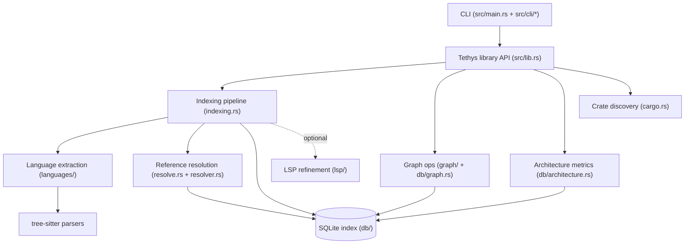
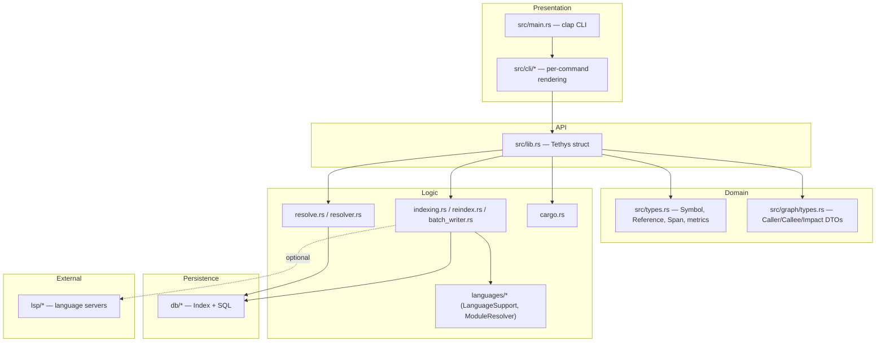
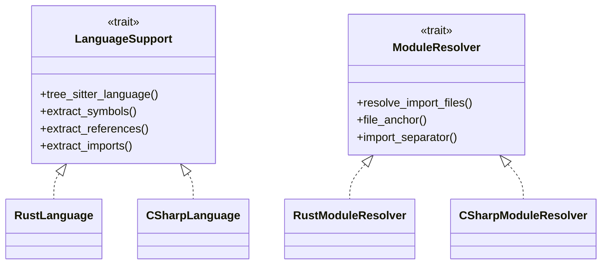
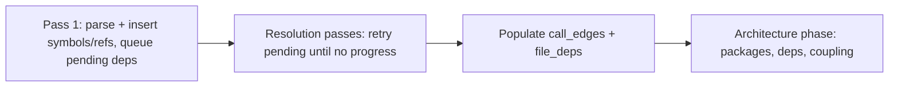
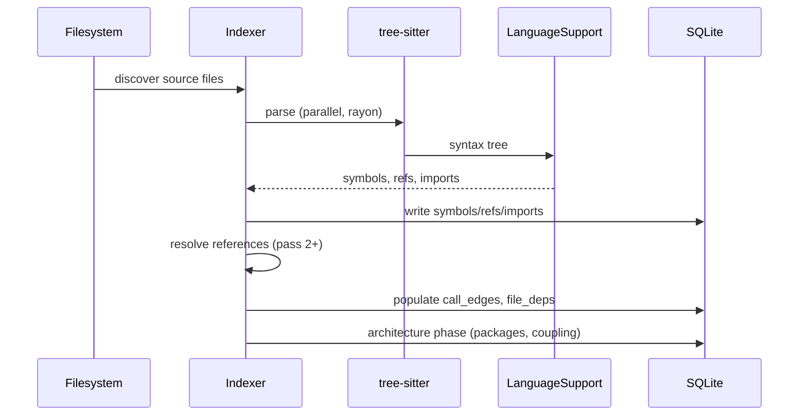

# Architecture

## System Overview

tethys is a layered code-intelligence system. Source files are parsed with
tree-sitter, extracted into a normalized domain model, persisted to SQLite, and
queried through graph operations and architecture metrics. The CLI is a thin
presentation layer over the `Tethys` library API.

## Layers

## Key Design Patterns

### Trait-based language extensibility (Strategy pattern)

Language-specific logic is isolated behind two traits, dispatched by `Language`:

- `LanguageSupport` (`languages/mod.rs`) — extracts symbols, references, and
  imports from a tree-sitter tree. Implemented by `RustLanguage` and
  `CSharpLanguage`.
- `ModuleResolver` (`languages/module_resolver.rs`) — translates module paths to
  files, provides per-file anchors, and defines the stored-import separator
  (`::` for Rust, `.` for C#).

### The resolution "seam" (language-neutral drivers)

A core architectural invariant: the resolution drivers in `resolve.rs` and
`indexing.rs` must remain **language-neutral**. All language-specific module
semantics live behind `ModuleResolver` implementations. This boundary is
enforced by `tests/seam_lint.rs`, which fails the build if `resolve.rs` or
`indexing.rs` contain Rust/C#-specific module logic, or if `ModuleResolver`
implementations touch the database directly.

### Graph operations via SQL recursive CTEs

Graph traversal (callers, callees, transitive impact, cycle detection, path
finding) is implemented as concrete `db::Index` operations in `db/graph.rs`
using SQLite recursive common table expressions. `Tethys` is the external
graph-analysis seam; there is no speculative adapter trait or in-memory graph.

### Two-pass deferred dependency resolution

Indexing tolerates circular and forward dependencies by deferring unresolved
references. See `workflows.md` for the full sequence.

### Architecture metrics (Robert C. Martin's coupling)

`db/architecture.rs` rolls file-level dependencies up to package level and
computes afferent coupling (Ca), efferent coupling (Ce), and instability
(I = Ce / (Ca + Ce)). The `arch_coupling` SQL view computes Ca/Ce; instability
is deliberately computed once in Rust (`CouplingMetrics::instability`) rather
than in SQL to keep the formula in a single place.

### Batch vs. streaming write modes

The indexer supports two write strategies (`IndexOptions`):

- **Batch** (default) — collect parsed data, then write.
- **Streaming** — `BatchWriter` runs a dedicated writer thread consuming parsed
  files in configurable batches, bounding peak memory for large workspaces.

### Error modeling

`error.rs` defines a top-level `Error` plus a structured `IndexError` carrying an
`IndexErrorKind` (input vs. internal categorization). Per-file indexing errors
are collected rather than aborting the whole run.

## Data Flow

## Concurrency Model

- Parsing is parallelized with `rayon` over discovered files; `parallel.rs`
  provides owned, `Send` data structures (`ParsedFileData`, `OwnedSymbolData`)
  so parse results can cross thread boundaries before DB writes.
- SQLite writes are serialized (single connection / writer thread in streaming
  mode).
