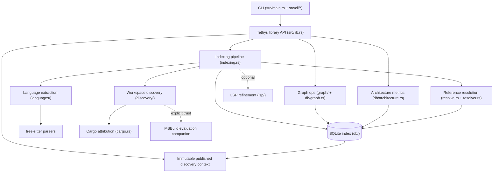
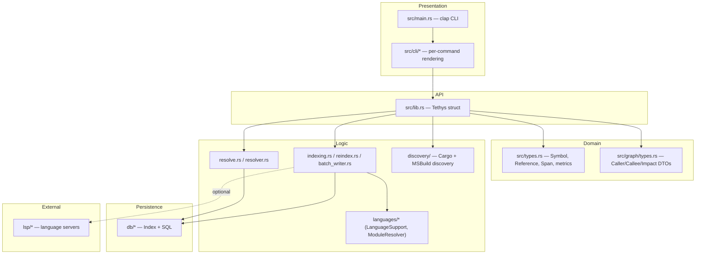
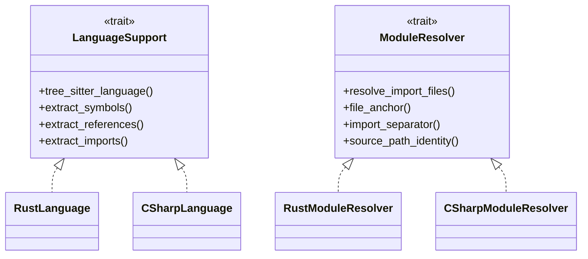
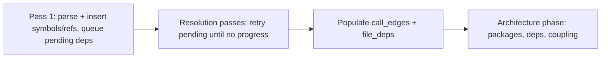
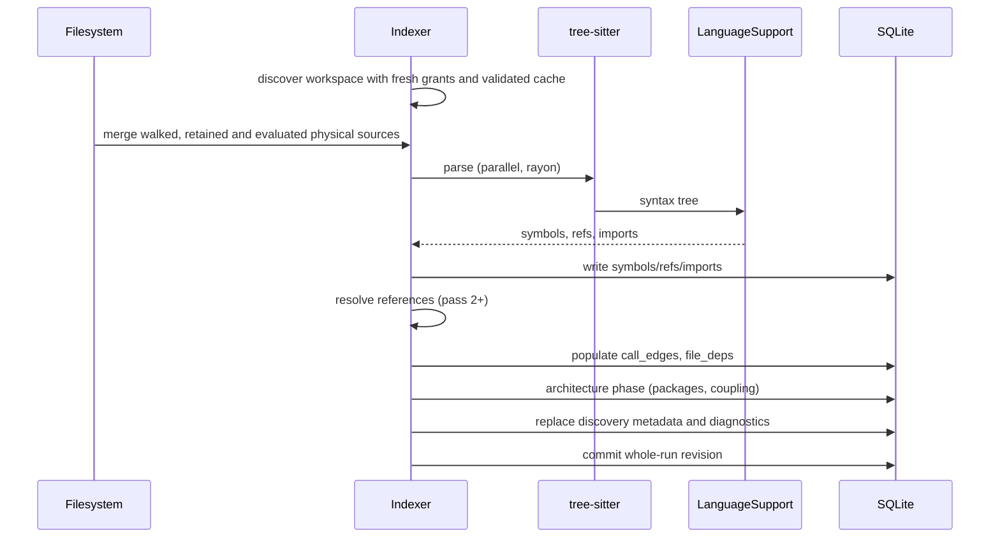

# Architecture

## System Overview

tethys is a layered code-intelligence system. Source files are parsed with
tree-sitter, extracted into a normalized domain model, persisted to SQLite, and
queried through graph operations and architecture metrics. The CLI is a thin
presentation layer over the `Tethys` library API.

```mermaid
graph TB
    CLI["CLI (src/main.rs + src/cli/*)"] --> LIB["Tethys library API (src/lib.rs)"]
    LIB --> IDX["Indexing pipeline (indexing.rs)"]
    LIB --> GRAPH["Graph ops (graph/ + db/graph.rs)"]
    LIB --> ARCH["Architecture metrics (db/architecture.rs)"]

    IDX --> LANG["Language extraction (languages/)"]
    IDX --> RESOLVE["Reference resolution (resolve.rs + resolver.rs)"]
    IDX --> DB[("SQLite index (db/)")]
    IDX -.optional.-> LSP["LSP refinement (lsp/)"]

    LANG --> TS["tree-sitter parsers"]
    GRAPH --> DB
    ARCH --> DB
    RESOLVE --> DB
    IDX --> DISC["Workspace discovery (discovery/)"]
    DISC --> CARGO["Cargo attribution (cargo.rs)"]
    DISC -.explicit trust.-> MSBUILD["MSBuild evaluation companion"]
    LIB --> CONTEXT["Immutable published discovery context"]
    DB --> CONTEXT
```

## Layers

```mermaid
graph TD
    subgraph Presentation
        A1["src/main.rs — clap CLI"]
        A2["src/cli/* — per-command rendering"]
    end
    subgraph API
        B1["src/lib.rs — Tethys struct"]
    end
    subgraph Domain
        C1["src/types.rs — Symbol, Reference, Span, metrics"]
        C2["src/graph/types.rs — Caller/Callee/Impact DTOs"]
    end
    subgraph Logic
        D1["indexing.rs / reindex.rs / batch_writer.rs"]
        D2["resolve.rs / resolver.rs"]
        D3["languages/* (LanguageSupport, ModuleResolver)"]
        D4["discovery/ — Cargo + MSBuild discovery"]
    end
    subgraph Persistence
        E1["db/* — Index + SQL"]
    end
    subgraph External
        F1["lsp/* — language servers"]
    end

    A1 --> A2 --> B1
    B1 --> C1 & C2
    B1 --> D1 & D2 & D4
    D1 --> D3
    D1 --> E1
    D2 --> E1
    D1 -.optional.-> F1
```

## Key Design Patterns

### Trait-based language extensibility (Strategy pattern)

Language-specific logic is isolated behind two traits, dispatched by `Language`:

- `LanguageSupport` (`languages/mod.rs`) — extracts symbols, references, and
  imports from a tree-sitter tree. Implemented by `RustLanguage` and
  `CSharpLanguage`.
- `ModuleResolver` (`languages/module_resolver.rs`) — translates module paths to
  files, provides per-file anchors, defines the stored-import separator
  (`::` for Rust, `.` for C#), and owns the private language-path identity policy
  `source_path_identity() -> SourcePathIdentity::{Logical, Physical}`
  (tethys-82a6). Rust selects logical identities; C# selects contained physical
  identities. Neutral source-selection, freshness and query-path callers consume
  this policy through the existing resolver registry; no public API or module
  is added.

```mermaid
classDiagram
    class LanguageSupport {
        <<trait>>
        +tree_sitter_language()
        +extract_symbols()
        +extract_references()
        +extract_imports()
    }
    class RustLanguage
    class CSharpLanguage
    LanguageSupport <|.. RustLanguage
    LanguageSupport <|.. CSharpLanguage

    class ModuleResolver {
        <<trait>>
        +resolve_import_files()
        +file_anchor()
        +import_separator()
        +source_path_identity()
    }
    class RustModuleResolver
    class CSharpModuleResolver
    ModuleResolver <|.. RustModuleResolver
    ModuleResolver <|.. CSharpModuleResolver
```

### The resolution "seam" (language-neutral drivers)

A core architectural invariant: the resolution drivers in `resolve.rs` and
`indexing.rs` must remain **language-neutral**. All language-specific module
semantics live behind `ModuleResolver` implementations. This boundary is
enforced by `tests/seam_lint.rs`, which fails the build if `resolve.rs` or
`indexing.rs` contain Rust/C#-specific module logic, or if `ModuleResolver`
implementations touch the database directly.

### Graph operations via SQL recursive CTEs

Graph traversal (callers, callees, transitive impact, cycle detection, path
finding) is implemented as concrete `db::Index` operations in `db/graph.rs`
using SQLite recursive common table expressions. `Tethys` is the external
graph-analysis seam; there is no speculative adapter trait or in-memory graph.

### Discovery and publication

Every index/update invokes workspace discovery with fresh options and persisted
cache receipts before source extraction. Evaluation and restore require separate
invocation-local grants; published grants never become authority for another run.
Qualified cache reuse validates current inputs and still requires evaluation trust.
See [MSBuild discovery operations](../../docs/msbuild-evaluation.md) for CLI flags,
host policy, cache restrictions and incomplete-coverage handling.

The facade exposes an immutable `DiscoverySnapshot`; query construction hydrates
the published context from SQLite without probing MSBuild or running evaluation.
One revision transaction publishes discovery metadata, memberships, input scopes,
cache evidence and diagnostics with source, resolution and architecture facts.
Failure restores both the previous database revision and in-memory context.
A schema-upgrade rebuild uses that same transaction, preserving the previous
schema on failure rather than deleting the index before opening it.

Source selection merges walked sources, retained indexed sources still on disk,
and current evaluated sources under the resolver's identity policy. Rust keeps
distinct logical aliases, including links to external targets; C# canonicalizes
and deduplicates physical files within the workspace. Many C# evaluation units
can share one syntax file; metadata withdrawal does not remove independent
syntax. Candidate/project/unit failures publish explicit incomplete coverage
alongside available source; the CLI exits 1 after that publication. Discovery
metadata is not C# compiler binding or proof of a selected-unit dependency.

### Two-pass deferred dependency resolution

Indexing tolerates circular and forward dependencies by deferring unresolved
references. See `workflows.md` for the full sequence.

```mermaid
graph LR
    P1["Pass 1: parse + insert symbols/refs, queue pending deps"] --> P2["Resolution passes: retry pending until no progress"]
    P2 --> CE["Populate call_edges + file_deps"]
    CE --> ARCH["Architecture phase: packages, deps, coupling"]
```

### Architecture metrics (Robert C. Martin's coupling)

`src/architecture.rs` owns coupling records, evidence propagation, the instability
formula, and architecture-phase assembly. Cargo and MSBuild adapters own their
attribution rules; C# physical files are not assigned to Cargo nodes.
`db/architecture.rs` stores one node per crate or evaluation unit and rolls
Rust file-level dependencies into indexed Ca/Ce. Its list/detail queries read
one SQLite snapshot, including unit metadata and declaration evidence.

Unselected project references withhold source Ce and candidate-unit Ca rather
than manufacturing edges. Confirmed isolated units retain known zero; incomplete
discovery withholds potentially affected incoming counts. Instability is derived
only when both counts are known. See the [coupling contract](../../docs/msbuild-evaluation.md#evidence-aware-coupling).

### Batch vs. streaming write modes

The indexer supports two write strategies (`IndexOptions`):

- **Batch** (default) — collect parsed data, then write.
- **Streaming** — `BatchWriter` runs a dedicated writer thread consuming parsed
  files in configurable batches, bounding peak memory for large workspaces.

### Error modeling

`error.rs` defines a top-level `Error` plus a structured `IndexError` carrying an
`IndexErrorKind` (input vs. internal categorization). Per-file indexing errors
are collected rather than aborting the whole run.

## Data Flow

```mermaid
sequenceDiagram
    participant FS as Filesystem
    participant IDX as Indexer
    participant TS as tree-sitter
    participant LANG as LanguageSupport
    participant DB as SQLite
    IDX->>IDX: discover workspace with fresh grants and validated cache
    FS->>IDX: merge walked, retained and evaluated physical sources
    IDX->>TS: parse (parallel, rayon)
    TS->>LANG: syntax tree
    LANG-->>IDX: symbols, refs, imports
    IDX->>DB: write symbols/refs/imports
    IDX->>IDX: resolve references (pass 2+)
    IDX->>DB: populate call_edges, file_deps
    IDX->>DB: architecture phase (packages, coupling)
    IDX->>DB: replace discovery metadata and diagnostics
    IDX->>DB: commit whole-run revision
```

## Concurrency Model

- Parsing is parallelized with `rayon` over discovered files; `parallel.rs`
  provides owned, `Send` data structures (`ParsedFileData`, `OwnedSymbolData`)
  so parse results can cross thread boundaries before DB writes.
- SQLite writes are serialized (single connection / writer thread in streaming
  mode).
