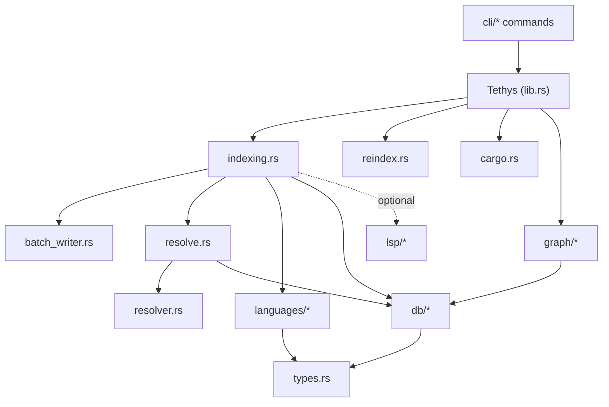

# Components

This document describes the major components and their responsibilities. Each
maps to a module or file under `src/`.

## Component Map

## Library Core

### `Tethys` (`src/lib.rs`)
The primary public API and facade. Owns the workspace root, the database
(`db::Index`), the resolved DB path, and discovered crates. Exposes indexing
(`index`, `index_with_options`), symbol/reference queries (`search_symbols`,
`get_symbol`, `list_symbols`, `get_references`), graph queries (`get_callers`,
`get_impact`, `get_dependencies`, `get_dependency_chain`, `detect_cycles`,
forward/backward reachability), architecture queries (`get_packages`,
`get_coupling_metrics`, `get_package_coupling`), panic-point and affected-test
queries, plus maintenance (`vacuum`, stats). Created with `Tethys::new`; LSP
opt-in via `with_lsp`.

### `types` (`src/types.rs`)
The domain model and the largest single source file. Defines the core records
(`Symbol`, `Reference`, `Import`, `IndexedFile`, `Span`), strongly-typed IDs
(`SymbolId`, `FileId`, `RefId`, `PackageId`), enums (`Language`, `SymbolKind`,
`Visibility`, `ReferenceKind`, `PanicKind`, `ReachabilityDirection`,
`CouplingSort`), signatures (`FunctionSignature`, `Parameter`, `ParameterKind`),
result/stat structures (`IndexStats`, `DatabaseStats`, `Impact`,
`ReachabilityResult`, `Cycle`, `StalenessReport`, `IndexUpdate`), architecture
types (`Package`, `CouplingMetrics`, `CouplingDetail`, `PackageDependency`,
`ArchStats`), LSP outcome types, and `IndexOptions`/`CrateInfo`. See
`data_models.md`.

### `error` (`src/error.rs`)
`Error` (top-level, re-exported), `IndexError`, and `IndexErrorKind`. Distinguishes
input errors (unsupported language, parse failure, encoding, I/O) from internal
errors, with helpers like `is_input_error` / `is_internal_error`.

## Indexing Subsystem

### `indexing.rs`
Orchestrates the full pipeline as methods on `Tethys`: file discovery
(`discover_files`, `walk_dir`, `is_excluded_dir`), parallel parsing, symbol/map
building, reference and import storage, deferred dependency resolution
(`resolve_pending`), dependency computation (`compute_dependencies`,
`compute_all_dependencies`), namespace mapping for C#
(`build_namespace_map`), and the architecture phase (`run_architecture_phase`).
Holds the `PendingDependency` type.

### `batch_writer.rs`
`BatchWriter` implements streaming-mode persistence: a dedicated writer thread
consumes parsed files in configurable batches (`WriteStats`, `BatchWriteResult`),
bounding memory for large workspaces.

### `parallel.rs`
`ParsedFileData` and `OwnedSymbolData` — owned, `Send` representations of parse
output so rayon workers can hand results to the DB layer.

### `reindex.rs`
Incremental reindex and staleness detection. `FileChange` classification,
`get_stale_files`, `needs_update`, `rebuild` / `rebuild_with_options`, and
`update` (maps `IndexStats` → `IndexUpdate`). Uses mtime to detect changes.

## Resolution Subsystem

### `resolve.rs`
The **language-neutral** cross-file reference resolution driver. Builds import
maps per file (`build_import_maps`), resolves references via explicit imports,
glob imports, and qualified-module fallback (`try_resolve_reference`,
`resolve_symbol_in_module`, `resolve_module_to_file_id`), and optionally refines
via LSP (`resolve_via_lsp`, `get_callers_with_lsp`). Holds `ResolveContext`. Must
not contain language-specific module semantics (enforced by `seam_lint`).

### `resolver.rs`
Rust-specific module-path resolution: maps `crate::`, `self::`, `super::`, and
workspace-crate paths to files (`resolve_module_path`, `resolve_crate_path`,
`resolve_self_path`, `resolve_super_path`, `resolve_as_module`).

### `cargo.rs` (public)
Cargo workspace and crate discovery. `discover_crates` walks `Cargo.toml`
manifests (including virtual workspaces and glob members), and computes
per-file module paths (`compute_module_path`, `get_crate_for_file`,
`determine_entry_point`).

## Language Subsystem (`src/languages/`)

### `mod.rs`
Declares `LanguageSupport` and dispatch (`get_language_support`). Documents the
five-step procedure for adding a new language.

### `rust.rs` / `csharp.rs`
`RustLanguage` and `CSharpLanguage` implementations: symbol extraction (incl.
nested types, impl methods, attributes, test detection), reference extraction
(calls, constructors, type annotations), and import extraction (`use` /
`using`). Each defines an intermediate import type (`UseStatement`,
`UsingDirective`).

### `module_resolver.rs`
`ModuleResolver` trait + `RustModuleResolver` / `CSharpModuleResolver`, the
`get_module_resolver` registry, and `ModuleContext` / `NamespaceMap`. Encodes
per-language import separators, qualified-name splitting, and glob policy.

### `common.rs` / `tree_sitter_utils.rs`
Shared extraction DTOs (`ExtractedSymbol`, `ExtractedReference`,
`ExtractedAttribute`, `ImportStatement`) and tree-sitter node helpers
(`node_text`, `node_span`).

## Persistence Subsystem (`src/db/`)

| Module | Responsibility |
|--------|----------------|
| `mod.rs` | `Index` struct: open/connect, schema apply, pragmas, stats, vacuum/analyze, reset |
| `schema.rs` | Full SQL schema string + arch view |
| `symbols.rs` | Insert/search symbols, qualified-name & in-file lookups, test symbols |
| `references.rs` | Insert/resolve references, unresolved-for-LSP queries |
| `imports.rs` | Insert / clear / fetch imports per file |
| `call_edges.rs` | Populate call graph edges (incl. hybrid cross-crate corroboration), file_deps from edges |
| `file_deps.rs` | Insert/clear/fetch file-level dependency edges |
| `graph.rs` | Recursive-CTE implementations of graph traversal + cycle detection |
| `architecture.rs` | Repopulate packages/deps, coupling metrics, neighbor drill-down |
| `panic_points.rs` | Query `.unwrap()`/`.expect()` occurrences |
| `files.rs` | Upsert/list files, language filters, path normalization |
| `helpers.rs` | Row → domain mapping + enum parsing |

## Graph Subsystem (`src/graph/`)

- `mod.rs` — re-exports internal graph query result types.
- `types.rs` — DTOs returned by concrete `Index` queries: `CallerInfo`,
  `SymbolImpact`, `FileDepInfo`, `FileImpact`, `FilePath`.

## LSP Subsystem (`src/lsp/`)

- `transport.rs` — `LspClient`: JSON-RPC over stdio (initialize, did_open,
  goto_definition, find_references, shutdown), URI/path conversion with
  percent-encoding.
- `provider.rs` — `LspProvider` trait + `RustAnalyzerProvider`,
  `CSharpLsProvider`, and `AnyProvider` dispatcher (command, args, init options,
  install hint).
- `error.rs` — `LspError` (not-found, spawn-failed, server-error).

## CLI Subsystem (`src/cli/`)

One module per command (`index`, `search`, `callers`, `impact`, `coupling`,
`cycles`, `stats`, `reachable`, `affected_tests`, `panic_points`), plus
`display.rs` (caller/dependent formatting) and `mod.rs` (LSP availability check,
broken-pipe handling). Commands call into the `Tethys` library and render
human-readable or JSON output.
