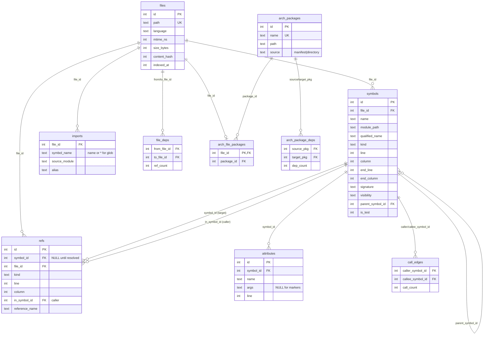

# Data Models

tethys has two model layers:

1. **Domain model** (`src/types.rs`) — Rust structs/enums used across the API.
2. **Persistence model** (`src/db/schema.rs`) — the SQLite schema.

Extraction also uses **intermediate DTOs** (`languages/common.rs`) that sit
between tree-sitter and the domain model.

## Database Schema

### Table notes

- **files** — one row per indexed source file. `mtime_ns` drives staleness
  detection during reindex; `content_hash` supports change detection.
- **symbols** — definitions. `module_path` + `name` form `qualified_name`.
  `parent_symbol_id` is self-referential (e.g. methods → impl/struct, nested
  types). `is_test` flags test functions (indexed via language-specific test
  attributes). All FKs cascade on delete.
- **refs** — usages. `symbol_id` is **NULL until resolved** in Pass 2;
  `reference_name` carries the unresolved name. `in_symbol_id` is the
  containing (calling) symbol, enabling "who calls X?".
- **file_deps** — denormalized file→file edges with `ref_count`, for fast
  dependency queries.
- **imports** — `use` / `using` statements. `symbol_name` is `*` for globs;
  `source_module` uses the language's separator (`::` Rust, `.` C#); `alias`
  for renamed imports.
- **call_edges** — precomputed caller→callee edges (from resolved refs) for
  efficient graph lookups. Cross-crate edges are corroborated against imports
  (the "k-hybrid" logic in `call_edges.rs`).
- **attributes** — symbol attributes (`#[derive(...)]`, `#[source]`, etc.).
  `name` is the attribute path's leading identifier; `args` is raw text inside
  the outermost parens (NULL for marker attributes).
- **arch_packages / arch_file_packages / arch_package_deps** — architecture
  analysis: packages, file→package assignment (one package per file), and
  cross-package edges rolled up from `file_deps` (self-edges excluded).
- **arch_coupling** (VIEW) — computes afferent (Ca) and efferent (Ce) coupling
  via `LEFT JOIN`s so zero-edge packages stay visible. Instability is **not**
  computed in SQL.

## Domain Model (`src/types.rs`)

### Core records

| Type | Description |
|------|-------------|
| `Symbol` | A definition: name, kind, span, visibility, module/qualified path, optional signature, parent, `is_test`. `full_path` joins module + name. |
| `Reference` | A usage: kind, span, target/containing symbol, reference name. |
| `Import` | A resolved import statement. |
| `IndexedFile` | File record (path, language, mtime, size, hashes). |
| `Span` | Source range; validated (`new` rejects end-before-start), serde round-trips via `SpanRaw`. |
| `FunctionSignature` / `Parameter` / `ParameterKind` | Structured signature details (param count, `is_method`, `returns_result`, `returns_option`, self-kind). |

### Strongly-typed IDs

`SymbolId`, `FileId`, `RefId`, `PackageId` — newtype wrappers over integer IDs
(`as_i64`, `From`), preventing accidental cross-use.

### Enums

| Enum | Variants / role |
|------|-----------------|
| `Language` | `Rust`, `CSharp`; `from_extension`, `extensions`, `as_str`. |
| `SymbolKind` | function, method, struct, class, enum, trait, interface, etc. |
| `Visibility` | public/private/etc.; round-trips through `as_str`/`parse`. |
| `ReferenceKind` | `Call`, `Type`, `Construct`, `Inherit`, `FieldAccess`, `Import`, plus `Unknown` (forward-compatible via `parse_or_unknown`). |
| `PanicKind` | `Unwrap`, `Expect`. |
| `ReachabilityDirection` | `Forward`, `Backward`. |
| `CouplingSort` | sort key for coupling output (default = instability). |
| `PackageSource` | `manifest` / `directory`. |

### Result & stats types

| Type | Description |
|------|-------------|
| `IndexStats` | Per-run counts: files indexed/skipped, symbols, references, errors, LSP session results, arch phase result. `total_lsp_resolved` sums sessions. |
| `DatabaseStats` | Aggregate index state (counts by language/kind). |
| `Impact` / `Dependent` | Impact analysis: direct + transitive dependents at depth. |
| `ReachabilityResult` / `ReachablePath` | Reachable symbols and paths, with depth filtering. |
| `Cycle` | A detected circular dependency (normalized rotation). |
| `StalenessReport` / `IndexUpdate` | Reindex inputs/outputs. |
| `FileAnalysis` | Per-file analysis result. |

### Architecture types

`Package`, `CouplingMetrics` (Ca, Ce, `instability` = Ce/(Ca+Ce)),
`CouplingDetail` (drill-down with neighbors), `PackageDependency`, `ArchStats`,
`ArchPhaseResult`.

### LSP types

`IndexOptions` (`use_lsp`, `lsp_timeout`, `use_streaming`, `streaming_batch_size`;
builder methods `with_lsp`, `with_streaming`), `LspSessionResult`,
`LspCompletedSession`, `LspOutcome`, `UnresolvedRefForLsp`.

### `CrateInfo`

Per-crate discovery result: name, path, lib/bin entry points, `src_root`,
`entry_point_file`.

## Graph DTOs (`src/graph/types.rs`)

`SymbolImpactCaller` (caller symbol, indexed-file path, and minimum depth),
`SymbolImpact` (target plus unique, depth-ordered callers with
direct/transitive views), `FileDepInfo`, `FileImpact`, and `FilePath`.

## Extraction DTOs (`src/languages/common.rs`)

Intermediate output of tree-sitter extraction, before mapping to the domain
model: `ExtractedSymbol`, `ExtractedReference` (+ `ExtractedReferenceKind`:
`Call`/`Type`/`Constructor`), `ExtractedAttribute`, `ImportStatement`.
`ExtractedReferenceKind::to_db_kind` maps to `types::ReferenceKind`.
