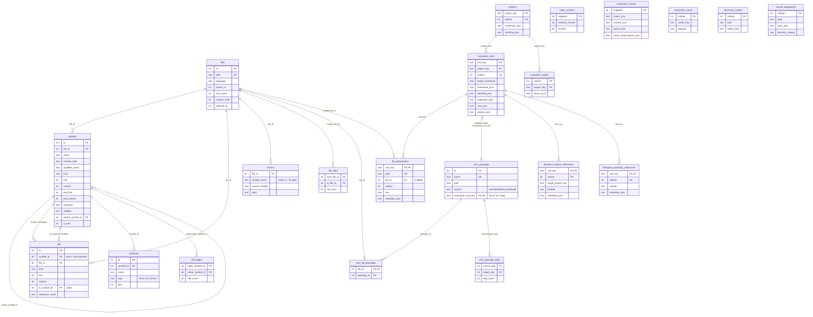

# Data Models

tethys has two model layers:

1. **Domain model** (`src/types.rs`, `src/discovery/types.rs`) — Rust structs/enums used across the API.
2. **Persistence model** (`src/db/schema.rs`) — the SQLite schema.

Extraction also uses **intermediate DTOs** (`languages/common.rs`) that sit
between tree-sitter and the domain model.

## Database Schema

Schema **3** publishes discovery and source facts under one `index_revision`.
Incompatible schemas require a transactional `index --rebuild`; ordinary open
refuses them without mutation. The discovery tables hold one active result, not
a revision history.

```mermaid
erDiagram
    files ||--o{ symbols : "file_id"
    files ||--o{ refs : "file_id"
    files ||--o{ imports : "file_id"
    files ||--o{ file_deps : "from/to_file_id"
    symbols ||--o{ symbols : "parent_symbol_id"
    symbols ||--o{ refs : "symbol_id (target)"
    symbols ||--o{ refs : "in_symbol_id (caller)"
    symbols ||--o{ attributes : "symbol_id"
    symbols ||--o{ call_edges : "caller/callee_symbol_id"
    files ||--o| arch_file_packages : "file_id"
    arch_packages ||--o{ arch_file_packages : "package_id"
    arch_packages ||--o{ arch_package_deps : "source/target_pkg"
    projects ||--o{ evaluation_units : "project_key"
    projects ||--o{ evaluation_inputs : "project_key"
    evaluation_units ||--o{ file_participation : "unit_key"
    evaluation_units |o--o| arch_packages : "nullable unique evaluation_unit_key"
    files |o--o{ file_participation : "nullable file_id"
    evaluation_units ||--o{ declared_project_references : "unit_key"
    evaluation_units ||--o{ declared_assembly_references : "unit_key"

    index_revision {
        int singleton PK
        int schema_version
        int revision
    }
    evaluation_context {
        int singleton PK
        text crates_json
        text context_json
        text grants_json
        text cache_observations_json
    }
    projects {
        text project_key PK
        int ordinal UK
        text containers_json
        text standing_json
    }
    evaluation_units {
        text unit_key PK
        text project_key FK
        int ordinal UK
        text target_framework
        text framework_json
        text standing_json
        text properties_json
        text host_json
        text restore_json
    }
    file_participation {
        text unit_key PK,FK
        text path PK
        int file_id FK "nullable"
        int ordinal
        text link
        text metadata_json
    }
    declared_project_references {
        text unit_key PK,FK
        int ordinal PK
        text target_project_key
        text include
        text metadata_json
    }
    declared_assembly_references {
        text unit_key PK,FK
        int ordinal PK
        text include
        text metadata_json
    }
    evaluation_inputs {
        int ordinal PK
        text project_key FK
        text inputs_json
    }
    evaluation_cache {
        int ordinal PK
        text cache_key
        text payload
    }
    discovery_issues {
        int ordinal PK
        text path
        text failure_json
    }
    source_diagnostics {
        int ordinal PK
        text path
        text error_json
        text directory_reason
    }

    files {
        int id PK
        text path UK
        text language
        int mtime_ns
        int size_bytes
        int content_hash
        int indexed_at
    }
    symbols {
        int id PK
        int file_id FK
        text name
        text module_path
        text qualified_name
        text kind
        int line
        int column
        int end_line
        int end_column
        text signature
        text visibility
        int parent_symbol_id FK
        int is_test
    }
    refs {
        int id PK
        int symbol_id FK "NULL until resolved"
        int file_id FK
        text kind
        int line
        int column
        int in_symbol_id FK "caller"
        text reference_name
    }
    file_deps {
        int from_file_id FK
        int to_file_id FK
        int ref_count
    }
    imports {
        int file_id FK
        text symbol_name "name or * for glob"
        text source_module
        text alias
    }
    call_edges {
        int caller_symbol_id FK
        int callee_symbol_id FK
        int call_count
    }
    attributes {
        int id PK
        int symbol_id FK
        text name
        text args "NULL for markers"
        int line
    }
    arch_packages {
        int id PK
        text name UK
        text path
        text source "manifest|directory|msbuild"
        text evaluation_unit_key FK,UK "NULL for Cargo"
    }
    arch_file_packages {
        int file_id PK,FK
        int package_id FK
    }
    arch_package_deps {
        int source_pkg FK
        int target_pkg FK
        int dep_count
    }
```

### Table notes

- **index_revision** — singleton schema currency and published revision identity.
  Updated with all discovery/source/resolution/architecture facts at publication;
  failed runs leave the previous identity and facts visible (`db/revision.rs`,
  tethys-82a6).
- **evaluation_context** — singleton Cargo attribution, requested context,
  recorded invocation grants and cache observations. Persisted grants never
  authorize another discovery invocation.
- **projects / evaluation_units** — stable project and project/framework/context
  identities, ordered outcomes and explicit standing. Units retain complete
  framework identity, evaluated properties and host/restore provenance.
- **file_participation** — many-to-many physical C# file membership across units.
  `(unit_key, path)` uses the canonical source path; `file_id` is optional because evaluation
  membership survives missing or unindexable syntax (`ON DELETE SET NULL`).
  Authored link and item metadata are retained. Conversely, removing membership
  does not delete independent source facts.
- **declared_project_references / declared_assembly_references** — evaluated
  declarations, not selected target-unit edges or compiler-resolved assemblies.
  `target_project_key` is not a foreign key: a declaration can name a project
  whose metadata is unavailable.
- **evaluation_inputs** — ordered captured input scopes per project observation,
  not a deduplicated path-stamp set or proof of currentness.
- **evaluation_cache** — opaque acceleration receipts validated on the next
  discovery invocation; separate from semantic metadata and captured input scopes.
- **discovery_issues / source_diagnostics** — candidate failures and source-file
  or skipped-directory diagnostics. Project/unit failures live in their standing
  records. Source diagnostic rows contain exactly one error or directory reason.
- **files** — one row per indexed source identity: logical paths for Rust
  (distinct aliases, including external targets), contained canonical physical
  paths for C# (deduplicated aliases). C# membership records do not impose a
  physical-identity rule on Rust. `mtime_ns` drives staleness detection during
  reindex; `content_hash` supports change detection.
- **symbols** — definitions. `module_path` + `name` form `qualified_name`.
  `parent_symbol_id` is self-referential (e.g. methods → impl/struct, nested
  types). `is_test` flags test functions (indexed via language-specific test
  attributes). All FKs cascade on delete.
- **refs** — usages. `symbol_id` is **NULL until resolved** in Pass 2;
  `reference_name` carries the unresolved name. `in_symbol_id` is the
  containing (calling) symbol, enabling "who calls X?".
- **file_deps** — denormalized file→file edges with `ref_count`, for fast
  dependency queries.
- **imports** — `use` / `using` statements. `symbol_name` is `*` for globs;
  `source_module` uses the language's separator (`::` Rust, `.` C#); `alias`
  for renamed imports.
- **call_edges** — precomputed caller→callee edges (from resolved refs) for
  efficient graph lookups. Cross-crate edges are corroborated against imports
  (the "k-hybrid" logic in `call_edges.rs`).
- **attributes** — symbol attributes (`#[derive(...)]`, `#[source]`, etc.).
  `name` is the attribute path's leading identifier; `args` is raw text inside
  the outermost parens (NULL for marker attributes).
- **arch_packages / arch_file_packages / arch_package_deps** — architecture
  analysis nodes for crates or evaluation units. `evaluation_unit_key` uniquely
  links MSBuild nodes to persisted metadata. File assignment remains one crate
  per Rust file; C# memberships stay many-to-many in `file_participation`.
  Rust cross-crate edges roll up from `file_deps` (self-edges excluded);
  project declarations never manufacture selected-unit edges.
- **arch_coupling** (VIEW) — computes afferent (Ca) and efferent (Ce) coupling
  via `LEFT JOIN`s so zero-edge packages stay visible. Instability is **not**
  computed in SQL.

## Domain Model (`src/types.rs`)

### Core records

| Type | Description |
|------|-------------|
| `Symbol` | A definition: name, kind, span, visibility, module/qualified path, optional signature, parent, `is_test`. `full_path` joins module + name. |
| `Reference` | A usage: kind, span, target/containing symbol, reference name. |
| `Import` | A resolved import statement. |
| `IndexedFile` | File record (path, language, mtime, size, hashes). |
| `Span` | Source range; validated (`new` rejects end-before-start), serde round-trips via `SpanRaw`. |
| `FunctionSignature` / `Parameter` / `ParameterKind` | Structured signature details (param count, `is_method`, `returns_result`, `returns_option`, self-kind). |

### Strongly-typed IDs

`SymbolId`, `FileId`, `RefId`, `PackageId` — newtype wrappers over integer IDs
(`as_i64`, `From`), preventing accidental cross-use.

### Enums

| Enum | Variants / role |
|------|-----------------|
| `Language` | `Rust`, `CSharp`; `from_extension`, `extensions`, `as_str`. |
| `SymbolKind` | function, method, struct, class, enum, trait, interface, etc. |
| `Visibility` | public/private/etc.; round-trips through `as_str`/`parse`. |
| `ReferenceKind` | `Call`, `Type`, `Construct`, `Inherit`, `FieldAccess`, `Import`, plus `Unknown` (forward-compatible via `parse_or_unknown`). |
| `PanicKind` | `Unwrap`, `Expect`. |
| `ReachabilityDirection` | `Forward`, `Backward`. |
| `CouplingSort` | sort key for coupling output (default = instability). |
| `PackageSource` | `manifest` / `directory`. |

### Result & stats types

| Type | Description |
|------|-------------|
| `IndexStats` | Per-run counts: files indexed/skipped, symbols, references, errors, LSP session results, arch phase result, and immutable discovery snapshot. `total_lsp_resolved` sums sessions. |
| `DatabaseStats` | Aggregate index state (counts by language/kind). |
| `ReachabilityResult` / `ReachablePath` | Reachable symbols and paths, with depth filtering. |
| `Cycle` | A detected circular dependency (normalized rotation). |
| `StalenessReport` / `IndexUpdate` | Reindex inputs/outputs. |
| `FileAnalysis` | Per-file analysis result. |

### Architecture types (`src/architecture.rs`)

`Package`, `PackageId`, `CouplingSort`, `CouplingMetrics`, `CouplingDetail`,
`PackageDependency`, `ArchStats`, and `ArchPhaseResult` are re-exported from
the library root. Counts and derived instability use `MetricEvidence<T>`:
`Known(T)` or `Indeterminate(CouplingIndeterminacy)`. `EvaluationUnitCoupling`
retains unit/project identity, framework, standing, assembly metadata and
separate declared references.

### LSP types

`IndexOptions` (`use_lsp`, `lsp_timeout`, `use_streaming`, `streaming_batch_size`;
builder methods `with_lsp`, `with_streaming`), `LspSessionResult`,
`LspCompletedSession`, `LspOutcome`, `UnresolvedRefForLsp`.

### `CrateInfo`

Per-crate discovery result: name, path, lib/bin entry points, `src_root`,
`entry_point_file`.

### Discovery records (`src/discovery/types.rs`)

`DiscoverySnapshot` contains Cargo crates, requested `EvaluationContext`,
`DiscoveryGrants`, `ProjectDiscovery` outcomes, `EvaluationUnit` outcomes,
`DiscoveryInputScope` observations, cache entries/observations and candidate issues.
`Tethys::discovery_snapshot` exposes the immutable published context; opening an
index hydrates it without MSBuild evaluation.

`ProjectKey` identifies a workspace-relative project file; `EvaluationUnitKey`
identifies a project/framework/context, never an assembly name.
`SourceMembership`, `DeclaredProjectReference` and `DeclaredAssemblyReference`
retain evaluated declarations separately from syntax and compiler bindings.
`DiscoveryStanding` is confirmed or indeterminate with a typed failure.
`IndexOptions::with_discovery` supplies fresh `DiscoveryOptions` for indexing and
updates; context and cache policy do not confer execution authority.

## Graph DTOs (`src/graph/types.rs`)

`FileImpactDependent` (indexed-file path and minimum dependency depth),
`FileImpact` (target path plus unique, depth-ordered dependents with
direct/transitive views), `SymbolImpactCaller` (caller symbol, indexed-file
path, and minimum call depth), `SymbolImpact` (target plus unique,
depth-ordered callers with direct/transitive views), and `FilePath`.

## Extraction DTOs (`src/languages/common.rs`)

Intermediate output of tree-sitter extraction, before mapping to the domain
model: `ExtractedSymbol`, `ExtractedReference` (+ `ExtractedReferenceKind`:
`Call`/`Type`/`Constructor`), `ExtractedAttribute`, `ImportStatement`.
`ExtractedReferenceKind::to_db_kind` maps to `types::ReferenceKind`.
