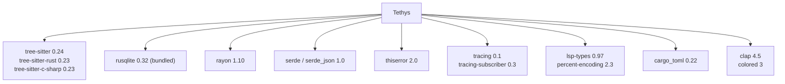

# Dependencies

External crates used by tethys, grouped by purpose. Versions reflect
`Cargo.toml` requirements (not exact resolved versions in `Cargo.lock`).

## Runtime Dependencies

| Crate | Version | Role | Used in |
|-------|---------|------|---------|
| `tree-sitter` | 0.24 | Incremental parser runtime | `languages/`, parsing |
| `tree-sitter-rust` | 0.23 | Rust grammar | `languages/rust.rs` |
| `tree-sitter-c-sharp` | 0.23 | C# grammar | `languages/csharp.rs` |
| `rusqlite` | 0.32 (`bundled`) | SQLite driver; `bundled` compiles SQLite in, so no system dependency | `db/` |
| `rayon` | 1.10 | Data-parallel file parsing | `indexing.rs`, `parallel.rs` |
| `serde` / `serde_json` | 1.0 | (De)serialization for JSON output and serde-able domain types | `types.rs`, CLI `--json` |
| `thiserror` | 2.0 | Derive-based error types | `error.rs`, `lsp/error.rs` |
| `tracing` | 0.1 | Structured logging facade | crate-wide |
| `tracing-subscriber` | 0.3 (`env-filter`, `fmt`, `ansi`) | Log subscriber for the CLI | `main.rs` |
| `lsp-types` | 0.97 | LSP protocol types | `lsp/` |
| `percent-encoding` | 2.3 | URI encoding for `file://` paths | `lsp/transport.rs` |
| `cargo_toml` | 0.22 | Parse `Cargo.toml` manifests | `cargo.rs` |
| `clap` | 4.5 (`derive`, `cargo`) | CLI argument parsing | `main.rs` |
| `colored` | 3 | Terminal color output | `main.rs`, `cli/` |

## Dev / Test Dependencies

| Crate | Version | Role |
|-------|---------|------|
| `tempfile` | 3.18 | Temporary workspaces/DBs in tests |
| `rstest` | 0.26 | Parameterized / fixture-based tests |
| `proptest` | 1.6 | Property-based testing (e.g. enum round-trips in `types.rs`) |
| `criterion` | 0.5 (`html_reports`) | Benchmarks (`benches/indexing.rs`, `benches/queries.rs`) |
| `tracing-test` | 0.2 | Assert on tracing output in tests |

Both benchmark targets set `harness = false` (Criterion provides its own
harness).

## Notable Choices & Constraints

- **Bundled SQLite** — `rusqlite`'s `bundled` feature means tethys ships its own
  SQLite; no system SQLite is required to build or run.
- **`unsafe_code = "forbid"`** — the crate forbids `unsafe`, so all
  dependencies must be usable through safe APIs.
- **License & advisory policy** (`deny.toml`) — only a fixed allow-list of
  licenses is permitted (MIT, Apache-2.0 [+LLVM-exception], BSD-2/3-Clause, ISC,
  MPL-2.0, Unicode-3.0, Unicode-DFS-2016). Sources must be crates.io.
  `RUSTSEC-2024-0436` (`paste`, unmaintained) is explicitly ignored as a
  transitive dependency. Multiple-version and wildcard checks are `warn`.
- **MSRV** — Rust `1.94.0`, pinned via `rust-toolchain.toml`.

## CI Toolchain Dependencies

Not crate dependencies, but required by the pipeline:

- `cargo-nextest` — test runner.
- `cargo-deny` (via `EmbarkStudios/cargo-deny-action@v2`) — license/advisory checks.
- `cargo-tarpaulin` — coverage, uploaded to Codecov.
- `rustfmt`, `clippy` — formatting and linting (toolchain components).

## Optional External Runtime: Language Servers

LSP refinement is opt-in and requires the relevant server on `PATH`:

- **rust-analyzer** (`RustAnalyzerProvider`) — used by `--lsp`.
- **csharp-ls** (`CSharpLsProvider`) — provider exists for C#.

If the server is missing, the command fails fast with an install hint rather
than silently degrading.
