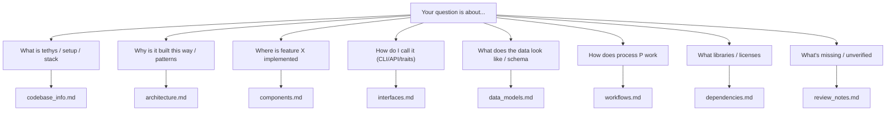

# tethys Documentation Knowledge Base — Index

> **For AI assistants:** This file is the primary entry point for understanding
> the tethys codebase. It describes every documentation file, what each covers,
> and which to consult for a given question. Load this file into context first;
> open the linked documents only when you need their detail.

## How to Use This Knowledge Base

1. Start here to locate the right document.
2. Open the specific file(s) below for detail.
3. For source-level certainty, follow the file/module references into `src/`.

Each document is self-contained and uses Mermaid diagrams (not ASCII art).

## Document Catalog

| Document | Read it when you need… |
|----------|------------------------|
| [codebase_info.md](codebase_info.md) | The high-level overview: what tethys is, tech stack, repo layout, module map, tooling/CI. Best first read. |
| [architecture.md](architecture.md) | System layers, design patterns (trait-based language extension, the resolution "seam", recursive-CTE graph ops, two-pass resolution, coupling metrics), data flow, concurrency. |
| [components.md](components.md) | Responsibilities of each module/file: `Tethys`, indexing subsystem, resolution, languages, `db/`, `graph/`, `lsp/`, CLI. The "where does X live?" map. |
| [interfaces.md](interfaces.md) | The CLI commands/flags, the `Tethys` library API, internal extension traits (`LanguageSupport`, `ModuleResolver`, graph ops, `LspProvider`), and the LSP integration. |
| [data_models.md](data_models.md) | The SQLite schema (ER diagram + table notes) and the domain model in `types.rs` (records, IDs, enums, stats, graph DTOs, extraction DTOs). |
| [workflows.md](workflows.md) | Step-by-step processes: indexing pipeline, cross-file resolution, incremental reindex, and each query workflow (callers, impact, reachability, cycles, coupling, affected-tests, panic-points). |
| [dependencies.md](dependencies.md) | External crates and why each is used, dev/test deps, license/advisory policy, MSRV, CI tooling, optional language servers. |
| [review_notes.md](review_notes.md) | Consistency/completeness review: known gaps, language-support limitations, and recommendations. |

## Question → Document Routing

### Common questions and where they are answered

- "What does tethys do and how do I run it?" → codebase_info.md, interfaces.md
- "How do I add support for a new language?" → architecture.md (seam),
  components.md (`languages/`), interfaces.md (`LanguageSupport` /
  `ModuleResolver`); source: `src/languages/mod.rs`.
- "How are cross-file references resolved?" → workflows.md (resolution flow),
  components.md (`resolve.rs` / `resolver.rs`).
- "What's in the database?" → data_models.md (schema); source: `src/db/schema.rs`.
- "How does impact / callers analysis work?" → workflows.md, interfaces.md;
  source: `src/db/graph.rs`, `src/graph/mod.rs`.
- "How are coupling metrics computed?" → architecture.md, data_models.md;
  source: `src/db/architecture.rs`.
- "How do I integrate this into CI?" → workflows.md (affected-tests),
  interfaces.md.

## Source Anchors (ground truth)

When documentation and code disagree, the code wins. Key files:

- `src/lib.rs` — `Tethys` API surface.
- `src/main.rs` — CLI definition.
- `src/types.rs` — domain model.
- `src/db/schema.rs` — database schema.
- `src/languages/mod.rs` — language extension contract.
- `tests/seam_lint.rs` — encodes the language-neutrality invariant.

## Maintenance

This knowledge base is generated by the codebase-summary process. Regenerate it
after significant structural changes. The root `AGENTS.md` is a consolidated,
navigation-focused companion; this index is the detailed reference.
