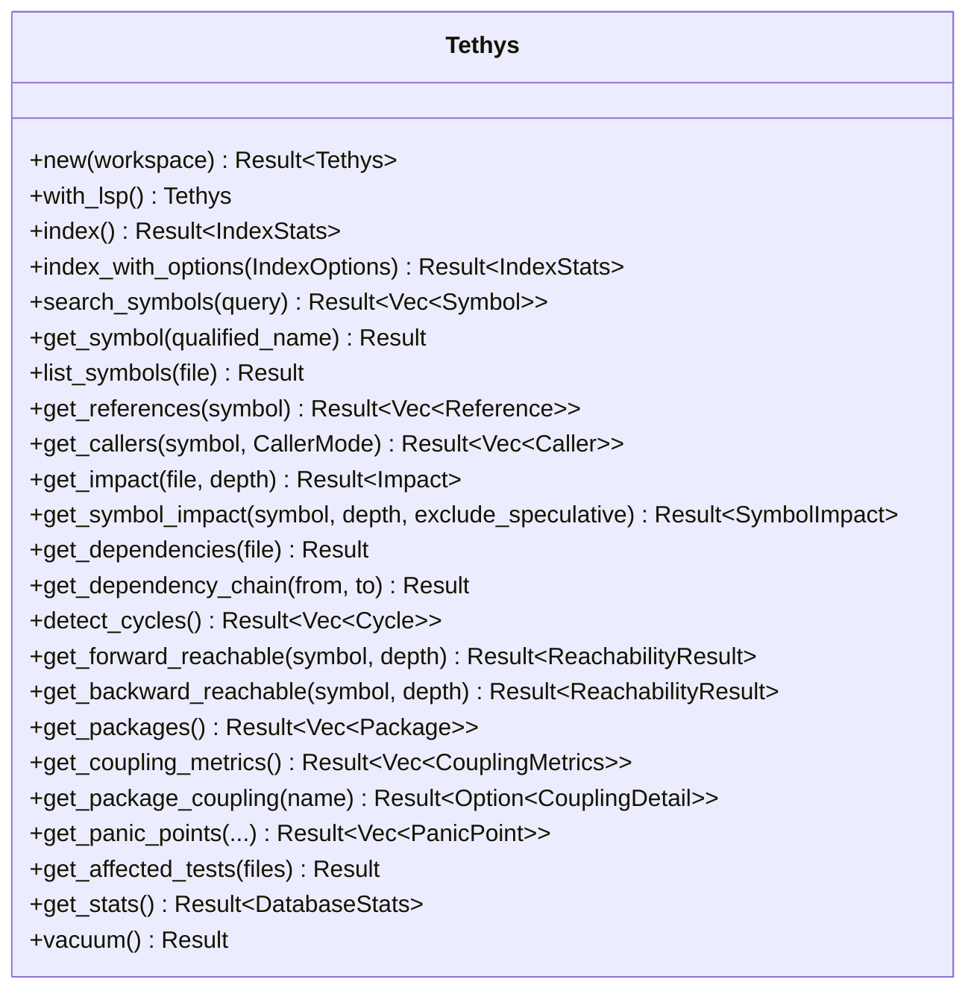

# Interfaces

tethys exposes three interface surfaces: the **CLI**, the **library API**
(`Tethys`), and internal **extension traits**. The LSP integration is an
outbound integration point.

## CLI Interface

Invoked as `tethys <command> [args]`. Global options apply to all commands:

- `-w, --workspace <DIR>` — workspace root (defaults to current directory).
- `-v, --verbose` — repeatable; raises log level (`warn` → `info` → `debug` → `trace`).
  The `RUST_LOG`-style env filter (`EnvFilter`) overrides this when set.

| Command | Arguments / Flags | Purpose |
|---------|-------------------|---------|
| `index` | `--rebuild`, `--lsp`, `--lsp-timeout <SECS>` | Index (or rebuild) the workspace. `--lsp` enables rust-analyzer refinement; timeout env `TETHYS_LSP_TIMEOUT`. |
| `search <query>` | `-k/--kind <KIND>`, `-l/--limit <N>` (default 20) | Search symbols by name (partial match), optionally filtered by kind. |
| `callers <symbol>` | `-t/--transitive`, `-d/--depth <N>` (default 50), `--lsp`, `--exclude-speculative` | Show callers of a qualified symbol. `--depth` requires transitive mode; `--lsp` is direct-only and conflicts with both transitive mode and speculative exclusion. |
| `impact <target>` | `-s/--symbol`, `-d/--depth <N>` (default 50), `--lsp` | Impact of changing a file (or symbol with `--symbol`). Symbol impact is Index-backed and rejects `--lsp`. |
| `coupling` | `--sort <KEY>`, `--package <NAME>`, `--json` | Per-crate coupling (Ca, Ce, instability). `--package` drills into one (conflicts with `--sort`). |
| `cycles` | — | Detect circular dependencies. |
| `stats` | — | Show index statistics. |
| `reachable <symbol>` | `-d/--direction <forward\|backward>`, `-n/--max-depth <N>` (default 10) | Forward/backward reachability traversal. |
| `affected-tests <files...>` | `--names-only` | Tests affected by changed files; `--names-only` for CI filtering. |
| `panic-points` | `--include-tests`, `--json`, `--file <PATH>` | Find `.unwrap()` / `.expect()` calls. |

### CLI conventions

- Exit code `0` on success, `1` on error; the error cause chain is printed to stderr.
- `--json` output is provided by `coupling` and `panic-points`. For
  `coupling --package <unknown> --json`, `null` is printed to stdout and the
  process exits non-zero.
- `BrokenPipe` on final/cosmetic writes is swallowed (so `tethys ... | head`
  exits cleanly).

## Library API (`Tethys`)

Construction:

```rust
let mut tethys = Tethys::new(Path::new("/path/to/workspace"))?; // discovers crates, opens DB
let tethys = tethys.with_lsp();                                  // opt-in LSP refinement
```

Representative methods (full list in `src/lib.rs`):



Direct caller queries require `CallerMode::Indexed { call_edges }` or
`CallerMode::LspRefined`. `CallEdgeSelection::ExcludeSpeculative` drops only
edges whose every supporting reference is speculative; mixed-support edges
survive. Each `Caller` identifies the caller `Symbol` and its workspace-relative
indexed-file path.

`discover_crates` is also re-exported at the crate root for standalone Cargo
discovery.

## Internal Extension and Query Interfaces

These internal interfaces are not part of the public API, but are central to
understanding the codebase.

### `LanguageSupport` (`languages/mod.rs`)
```rust
pub trait LanguageSupport: Send + Sync {
    fn tree_sitter_language(&self) -> tree_sitter::Language;
    fn extract_symbols(&self, tree: &Tree, content: &[u8]) -> Vec<ExtractedSymbol>;
    fn extract_references(&self, tree: &Tree, content: &[u8]) -> Vec<ExtractedReference>;
    fn extract_imports(&self, tree: &Tree, content: &[u8]) -> Vec<ImportStatement>;
}
```
Dispatched by `get_language_support(Language)`.

### `ModuleResolver` (`languages/module_resolver.rs`)
Translates module paths to files, supplies the per-file anchor, and defines the
stored-import separator. Dispatched by `get_module_resolver(Language)`. The
resolution drivers in `resolve.rs` / `indexing.rs` consume this trait without
knowing language specifics.

### Concrete graph queries (`db/graph.rs`)
Callers/callees, transitive impact, path finding, and cycle detection are
concrete `db::Index` operations implemented with recursive CTEs.

### `LspProvider` (`lsp/provider.rs`)
Abstracts a language server: `command`, `args`, `initialize_options`,
`install_hint`. `AnyProvider::for_language` returns the right provider
(`RustAnalyzerProvider` or `CSharpLsProvider`).

## Outbound Integration: LSP

When `--lsp` (or `IndexOptions::with_lsp()`) is set, tethys spawns a language
server and communicates over JSON-RPC (`Content-Length` framing) via `LspClient`
(`lsp/transport.rs`): `initialize` → `did_open` → `goto_definition` /
`find_references` → `shutdown`. LSP is used to refine references that
tree-sitter resolution could not resolve. If the server binary is absent,
commands fail fast with `LspError::NotFound` (with an install hint).

## Persistence Interface

The SQLite database at `.rivets/index/tethys.db` is itself a stable read
interface: external tooling can query the documented schema (see
`data_models.md`) directly. tethys applies the schema idempotently
(`CREATE ... IF NOT EXISTS`) on open.
