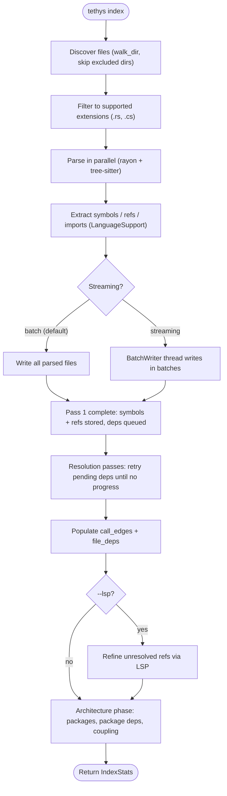
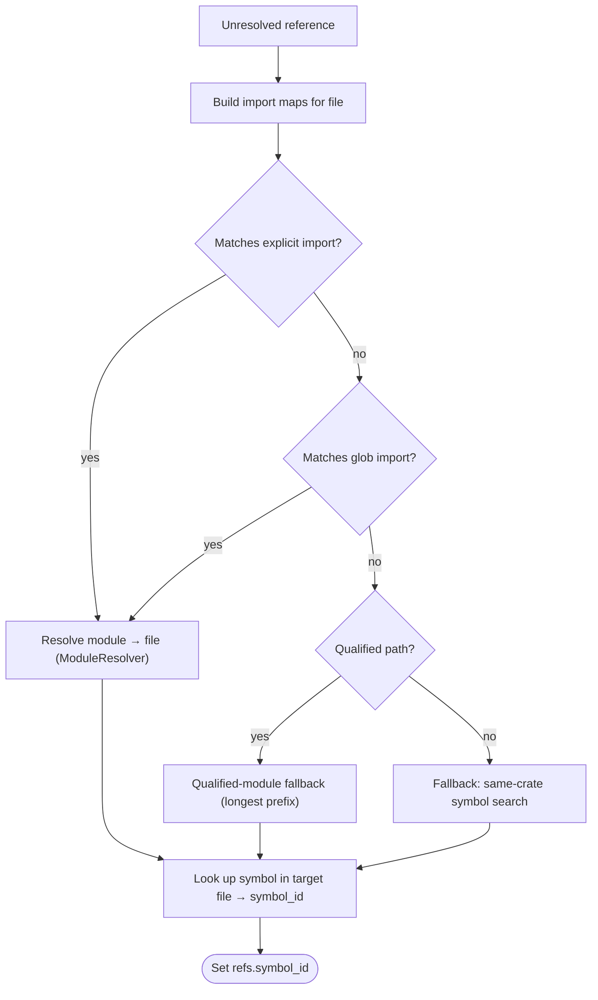
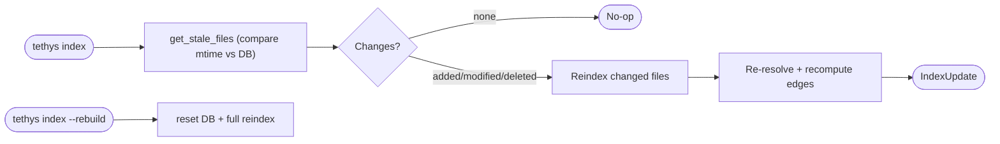
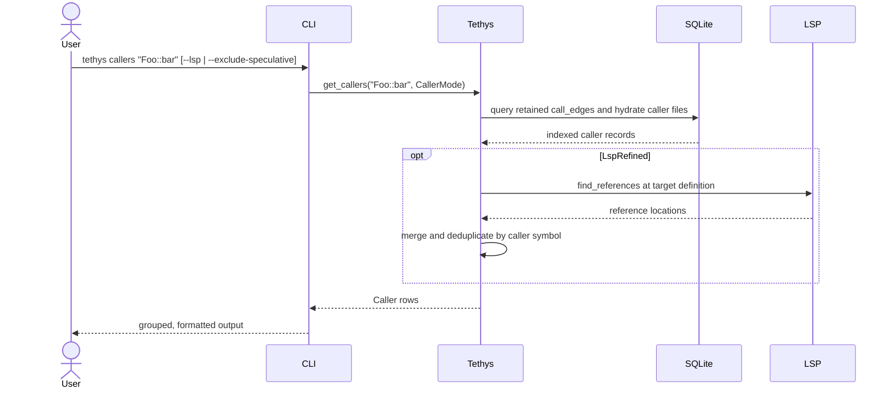
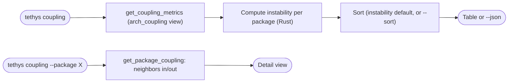
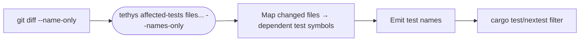
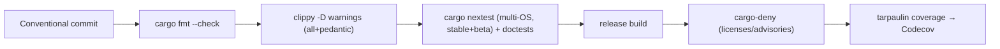

# Workflows

This document describes the key processes in tethys. They fall into two groups:
the **indexing pipeline** (write path) and **query workflows** (read path).

## Indexing Pipeline

### Stages

1. **Discovery** (`discover_files` / `walk_dir`) — recursively walks the
   workspace, skipping excluded directories (`target`, `node_modules`, `bin`,
   `obj`, `build`, `dist`, `vendor`, `__pycache__`, hidden dirs). Symlinks are
   followed with loop protection (see `tests/symlink_boundary.rs`).
2. **Filtering** — keeps files whose extension maps to a supported `Language`;
   others increment `files_skipped`.
3. **Parallel parsing** — `rayon` parses files concurrently; results become
   `ParsedFileData` (owned, `Send`).
4. **Extraction** — the language's `LanguageSupport` yields symbols, references,
   and imports from each tree.
5. **Persistence** — batch mode writes after parsing; streaming mode hands
   parsed files to a `BatchWriter` thread in configurable batches.
6. **Deferred resolution** — references to not-yet-indexed files are queued as
   `PendingDependency` and retried in resolution passes until no progress is
   made; this tolerates circular and forward references.
7. **Edge population** — `call_edges` (caller→callee) and `file_deps` are
   computed from resolved references. Cross-crate call edges are corroborated
   against imports before being kept.
8. **Optional LSP refinement** — when enabled, unresolved references are
   resolved via a language server.
9. **Architecture phase** — assigns files to packages, rolls `file_deps` up to
   `arch_package_deps`, and prepares coupling metrics.

### Cross-file reference resolution detail

The driver (`resolve.rs`) is language-neutral; all module-path semantics come
from `ModuleResolver`. Rust uses `crate::`/`self::`/`super::` resolution
(`resolver.rs`); C# uses namespace/using corroboration with a namespace map.

## Incremental Reindex Workflow

`reindex.rs` classifies each indexed file (`FileChange`: added, modified,
deleted, unchanged) by comparing filesystem mtime to the stored `mtime_ns`.
`--rebuild` clears the database (including WAL/SHM sidecars) and reindexes from
scratch.

## Query Workflows

### Callers / Impact

Transitive callers remain index-backed through symbol impact. The CLI rejects
`--lsp` with either `--transitive` or `--exclude-speculative`; unsupported
combinations are never silently ignored.

`impact` works the same way at file granularity over `file_deps`, or at symbol
granularity with `--symbol`. `--depth` bounds transitive traversal.

### Reachability

`reachable <symbol> --direction forward|backward --max-depth N` does a BFS over
the call graph (`get_forward_reachable` / `get_backward_reachable`), returning
reachable symbols grouped by depth. Cyclic graphs terminate safely.

### Cycle Detection

`cycles` runs DFS-based cycle detection over file dependencies
(`detect_cycles`), normalizing each cycle (rotated to a canonical start) and
deduplicating.

### Coupling / Architecture

### Affected Tests (CI)

This is the primary CI workflow: feed changed files in, get back the test names
that transitively depend on them, and run only those.

### Panic Points

`panic-points` queries symbols/refs for `.unwrap()` / `.expect()` occurrences
(`PanicKind`), optionally including tests, filtering to a file, or emitting JSON.

## Development Workflow (from CI config)

