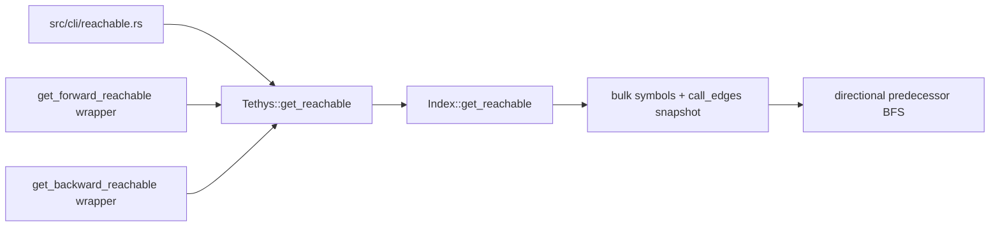

# Unified directional reachability: falsifiable design

## Purpose

Replace the legacy per-visited-symbol reachability loop with one canonical direction-parameterized operation. Preserve observable reachability behavior while moving bulk graph traversal and predecessor reconstruction into the concrete `Index` graph module behind the `Tethys` seam.

Evidence: `.tethys-7a6a/probe.rs` and the independent raw-SQLite `.tethys-7a6a/oracle.py` agree on 66 production-index entries across both directions, including IDs, minimum depths, paths, and discovery order. The probe also exposed the live forward `is_test` projection defect and duplicate source-name ambiguity documented in `.tethys-7a6a/findings.md`.

## Input shapes

| Input dimension | Production-reachable shapes | Required behavior |
|---|---|---|
| Direction | `Forward`, `Backward` | Follow caller→callee or callee→caller edges respectively. |
| Optional depth | `None`, `Some(0)`, `Some(1)`, finite `Some(N)`, `Some(u32::MAX as usize)`, and—on 64-bit targets—`Some(N > u32::MAX)` | Default 50; validate-only zero; direct-only one; finite bound; no warning at `u32::MAX`; saturation plus one warning above it. On 32-bit targets the oversized shape is unrepresentable and therefore not production-reachable. |
| Source lookup | Missing, unique qualified name, duplicate qualified name | Missing returns `Error::NotFound`; unique resolves normally; duplicate preserves first-row behavior tracked by `tethys-bvgb`. |
| Directional degree | No neighbors, one neighbor, many neighbors | Empty succeeds; one and many preserve deterministic adjacency and BFS order. |
| Topology | Chain, branch, diamond, self-loop, cycle through source, cycle away from source | Minimum-depth uniqueness, valid paths, termination, source excluded. |
| Route ties | One route, different-depth routes, equal-depth routes | First shortest route wins; equal-depth ties use deterministic first discovery. |
| Symbol projection | Test and non-test targets; duplicate target qualified names | Decode the real `is_test`; order equal names by symbol ID after qualified name. |
| Edge provenance | High/medium/speculative indexed call edges | Traverse all indexed edges; no `CallEdgeSelection` input. |
| Endpoint integrity | Both endpoints present; dangling endpoint from externally corrupted DB | Include complete edges; silently omit dangling neighbors as legacy inner joins do; propagate unrelated SQL/decode errors. |
| Caller surface | Canonical method, forward wrapper, backward wrapper, CLI four accepted spellings, invalid CLI spelling | One traversal implementation; wrappers delegate; CLI maps then calls canonical operation; invalid spelling remains a configuration error. |
| Scale | 0 edges, 1 reachable target, at least 100 reachable targets, self-index scale | Fixed statement count; $O(V+E)$ traversal plus output-bound path materialization. |

## Removed-invariant sweep

This is subtractive: it removes per-node SQL neighbor queries and queue-carried partial paths, and it removes the private facade traversal body that separately powered the two public wrappers.

The removed implementation enforced several facts indirectly:

1. Each per-node SQL query returned neighbors in qualified-name order. The snapshot must restore a total `(qualified_name, symbol_id)` adjacency order before BFS.
2. Inner joins silently omitted dangling endpoints. Snapshot loading must skip edges whose endpoint symbol is absent, while still propagating SQL and row-decoding failures; `tethys-e3j1` owns any posture change.
3. The visited set was seeded with the source. The predecessor map must also be seeded with the source so self-loops and cycles cannot reintroduce it.
4. Queue-carried paths were complete at discovery time. Predecessor reconstruction must preserve source exclusion, target inclusion, valid directional adjacency, and `path.len() == depth` after search.
5. Wrapper-specific closures selected opposite edge directions. One direction match in the `Index` operation must be the only point that transposes adjacency.
6. A database error could abort during any neighbor query. The bulk loader must collect every query row through `Result` and propagate failures rather than dropping malformed rows.

The snapshot also strengthens consistency: all symbols and call edges are read in one deferred transaction before CPU traversal.

## Architecture and placement



### Owner

- **Public interface and input normalization:** `Tethys` in `src/lib.rs`. It owns source lookup, `Error::NotFound`, optional-depth defaulting/saturation/warning, result envelope construction, and the temporary delegating wrappers.
- **Traversal implementation:** concrete `Index` graph operations in `src/db/graph.rs`. It owns one transactional snapshot, directional adjacency, total neighbor ordering, predecessor BFS, and path projection.
- **CLI adapter:** `src/cli/reachable.rs`. It owns string-to-`ReachabilityDirection` mapping and presentation only.
- **Domain records:** existing `ReachabilityDirection`, `ReachablePath`, and `ReachabilityResult` in `src/types.rs` remain unchanged.

### Interface

```rust
pub fn Tethys::get_reachable(
    &self,
    qualified_name: &str,
    direction: ReachabilityDirection,
    max_depth: Option<usize>,
) -> Result<ReachabilityResult>;

pub(crate) fn Index::get_reachable(
    &self,
    source_id: SymbolId,
    direction: ReachabilityDirection,
    max_depth: u32,
) -> Result<Vec<ReachablePath>>;
```

`get_reachable` follows the existing `get_type_hierarchy(name, direction)` naming shape. `get_forward_reachable` and `get_backward_reachable` become one-line delegators until verified issue `tethys-71if` removes them.

### Snapshot and traversal

1. Begin one deferred read transaction.
2. Select `SYMBOLS_COLUMNS` from `symbols` and decode through `row_to_symbol`; this places the real `s.is_test` at column 13.
3. Select every `(caller_symbol_id, callee_symbol_id)` from `call_edges` with no provenance filter.
4. Drop edges whose endpoint is absent from the symbol map, matching the legacy inner-join posture.
5. Build only the requested adjacency orientation and sort each neighbor list once by `(qualified_name, symbol_id)`.
6. Seed `parents` with the source sentinel and enqueue `(source_id, 0)`.
7. Expand only nodes whose depth is less than the effective maximum. On first discovery, record one predecessor, depth, and discovery sequence.
8. After discovery, reconstruct each output path by walking predecessors to the source, reverse it, and clone only the `Symbol` values required by the public result.

End-to-end database cost is fixed at three statements: one source lookup at the facade and two set-valued snapshot reads at `Index`. Search cost is $O(V+E)$ plus sorting $\sum_v O(\deg(v)\log\deg(v))$ and unavoidable result projection $O(\sum \text{path depth})$. Memory is $O(V+E)$ plus returned paths. No growing partial path is stored in the queue.

### Forbidden

- The CLI must not query `Index` directly or implement traversal.
- `Tethys` must not loop over `get_callees` or `get_callers`.
- The `Index` operation must not perform per-visited-symbol or per-result-symbol lookups.
- The bulk symbol query must not copy the defective `get_callees` projection that places `call_count` at `row_to_symbol` column 13.
- Results must not be globally sorted after BFS.
- The operation must not add Petgraph, an adapter trait, a mock graph seam, or a reachability-specific provenance mode.
- The change must not alter duplicate source lookup (`tethys-bvgb`) or dangling-edge policy (`tethys-e3j1`).

No new seam is introduced. The existing `Tethys` facade and concrete `Index` graph module already own the capability; the change deepens those modules by deleting traversal knowledge from callers.

## Claims

1. **Canonical seam:** `Tethys::get_reachable` is the only reachability traversal entry point; the CLI and both retained wrappers delegate to it, while traversal lives only in `Index::get_reachable`.
2. **Fixed snapshot cost:** one operation uses one source lookup plus two set-valued snapshot statements, independent of reachable target count, with zero per-symbol hydration queries.
3. **Directional edge semantics:** `Forward` follows every indexed caller→callee edge and `Backward` follows every indexed callee→caller edge.
4. **Shortest unique paths:** every reachable symbol appears once at minimum depth; each path excludes the source, includes the target last, has length equal to depth, and contains only direction-valid edges.
5. **Cycle safety:** self-loops and cycles terminate and return the source zero times.
6. **Discovery order:** results use FIFO BFS discovery order with `(qualified_name, symbol_id)`-sorted adjacency and no global result sort.
7. **Depth contract:** missing depth means 50; zero validates and returns empty; one is direct-only; finite bounds are monotone; oversized values saturate to `u32::MAX` and warn once.
8. **Projection correctness:** bulk symbol decoding preserves real test and non-test flags in both directions.
9. **Legacy edge behavior:** duplicate source names retain first-row lookup, dangling endpoints are silently omitted, and other database/decode errors propagate.
10. **Bounded search state:** BFS stores at most one predecessor and one queue entry per discovered symbol, uses $O(V+E)$ search memory, and never clones growing partial paths during search.

## Falsification

| # | Claim | Falsifier | Independent oracle | Cost | Status | Regression fence |
|---|---|---|---|---|---|---|
| 1 | Canonical seam | Inspect all reachability callsites; any production caller bypassing `Tethys::get_reachable`, wrapper containing traversal, or second traversal body falsifies the claim. Buggy implementation: wrappers retain their closures. | LSP references plus seam-lint source map | 3 min | pending | integration test `reachability_wrappers_match_canonical_operation` plus `tests/seam_lint.rs` |
| 2 | Fixed snapshot cost | Trace a one-target graph and a ≥100-target graph. Any statement-count delta, total other than 2 inside `Index`, or per-ID symbol SELECT falsifies the claim. Buggy implementation: call `get_callees` once per dequeue. | SQLite trace callback with scalar-query canary | 5 min | pending | unit test `reachability_snapshot_statement_counts_are_flat` |
| 3 | Directional edge semantics | Compare both public directions on the production self-index against raw `symbols`/`call_edges` BFS. Any differing target ID falsifies the claim. Buggy implementation: forget to transpose backward adjacency or filter speculative edges. | `.tethys-7a6a/oracle.py` | 1 min | passed: 66/66 entries agree | integration test `canonical_reachability_follows_edges_in_both_directions` |
| 4 | Shortest unique paths | Run a diamond with equal- and unequal-depth routes; any duplicate target, non-minimum depth, invalid adjacent pair, source in path, missing target, or length mismatch falsifies the claim. Buggy implementation: overwrite predecessors on rediscovery. | Hand-enumerated fixture edge set and independent test BFS | 8 min | pending | integration test `canonical_reachability_paths_are_shortest_unique_and_valid` |
| 5 | Cycle safety | Traverse both directions through a source self-loop and three-node cycle. Nontermination or any returned source falsifies the claim. Buggy implementation: omit the source sentinel from `parents`. | Fixture node/edge count and timeout | 4 min | pending | integration test `canonical_reachability_excludes_source_in_cycles` |
| 6 | Discovery order | Use a graph where queue discovery order differs from global `(depth, qualified_name)` order. Any globally sorted or nondeterministic sequence falsifies the claim. Buggy implementation: sort completed results or iterate unsorted `HashMap` neighbors. | Hand-enumerated FIFO queue transcript | 4 min | pending | integration test `canonical_reachability_preserves_bfs_discovery_order` |
| 7 | Depth contract | Exercise `None`, 0, 1, finite 2, `u32::MAX`, and—on 64-bit—`u32::MAX + 1`; wrong effective depth, boundary inclusion, or warning count falsifies the claim. Buggy implementation: retain raw `usize` or use `depth > max`. | Shared contract from `tethys-u1rs` plus captured tracing events | 7 min | pending | integration tests `canonical_reachability_obeys_depth_contract` and `canonical_reachability_saturates_oversized_depth` |
| 8 | Projection correctness | Reach a known non-test symbol forward and a known test symbol in each direction. Any flag differing from raw `symbols.is_test` falsifies the claim. Buggy implementation: decode `call_count` at column 13. | Direct SQLite `symbols.is_test` query | 3 min | pending | integration test `canonical_reachability_preserves_is_test` |
| 9 | Legacy edge behavior | Compare canonical lookup with existing first-row symbol lookup on a duplicate; inject one dangling endpoint and one decodable SQL failure. Different source selection, non-silent dangling behavior, or swallowed SQL/decode error falsifies the claim. Buggy implementation: validate all endpoints or use `filter_map(Result::ok)`. | Existing `get_symbol_by_qualified_name`, inner-join query, and concrete rusqlite error variant | 9 min | pending | integration test `canonical_reachability_preserves_source_and_dangling_posture` |
| 10 | Bounded search state | Audit queue/parent types and run the ≥100-target fixture. More than one parent/queue insertion per discovered ID or any queued `Vec<Symbol>` falsifies the claim. Buggy implementation: carry `path.clone()` in every queue item. | Type/AST inspection plus unique-discovery counters | 5 min | pending | unit test `reachability_bfs_discovers_each_symbol_once`; structural review of queue type |

### Cheapest falsifier execution

Claim 3 is the cheapest executable premise because its artifacts already exist. On 2026-08-08:

```text
python3 .tethys-7a6a/compare.py .tethys-7a6a/probe-a.out .tethys-7a6a/oracle-a.out
python3 .tethys-7a6a/compare.py .tethys-7a6a/probe-b.out .tethys-7a6a/oracle-b.out
```

Both comparisons returned `RESULT: AGREE`: 66/66 entries matched on IDs, depths, paths, and order across both directions. This kills the premise that bulk raw-edge BFS cannot reproduce the public directional semantics.

## Negative space

- No removal of the two public wrappers; verified issue `tethys-71if` owns that cutover.
- No repair of adjacent `get_callees`/`get_transitive_callers` projection bugs; verified issue `tethys-6bui` owns those methods.
- No unique-or-decline source lookup; verified issue `tethys-bvgb` owns duplicate qualified-name resolution.
- No new dangling-endpoint posture; verified issue `tethys-e3j1` now covers file-graph and call-graph traversal policy.
- No resolver under-count repair; verified issues `tethys-staf`, `tethys-qtq5`, and `tethys-z9mr` own those classes.
- No CLI output-layout, direction-spelling, or default-depth change.
- No Petgraph dependency, graph trait, mock graph adapter, or second public seam.

## Self-review

- **Claim count:** 10; within the 3–15 feature range.
- **Input coverage:** every direction, optional-depth shape, lookup result, topology, tie, projection, endpoint-integrity, caller surface, and scale shape maps to at least one claim.
- **Removed invariants:** neighbor order, dangling omission, source visitation, path materialization, directional selection, and error propagation each map to claims 3–10.
- **Falsifier independence:** every row names raw SQLite, hand-enumerated graph facts, tracing, LSP/seam lint, or concrete error variants rather than another implementation path.
- **Non-vacuity:** every row names a specific buggy implementation that would fail it.
- **Distinctness:** each falsifier emits a separate directional set, statement count, invariant failure, source count, sequence, depth/warning result, projection value, error posture, or state-shape result.
- **Regression fences:** every claim names a deterministic CI fence; claim 10 also retains a structural queue-type review because clone absence is not fully observable from output alone.
- **Cost distribution:** every falsifier is ≤9 minutes; none relies on staging or manual production observation.
- **Tracker references:** `tethys-71if`, `tethys-6bui`, `tethys-bvgb`, `tethys-e3j1`, `tethys-staf`, `tethys-qtq5`, and `tethys-z9mr` were verified by tracker research; `tethys-e3j1` was expanded on 2026-08-08 to cover reachability.
- **Placement:** public normalization at `Tethys`, traversal at concrete `Index`, CLI mapping at the adapter; no new seam.
- **Negative space:** seven explicit exclusions, each tracked where it represents deferred behavior.
