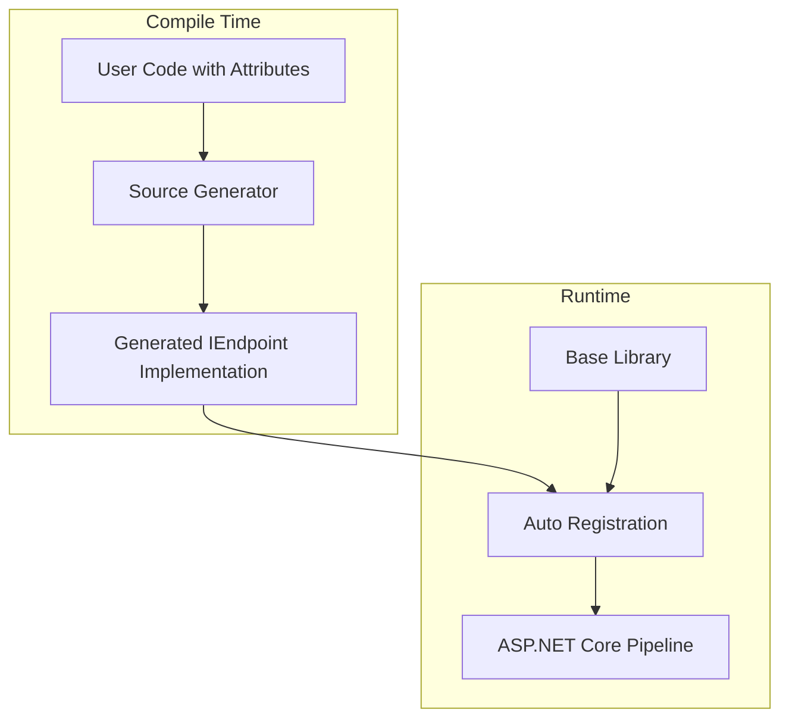
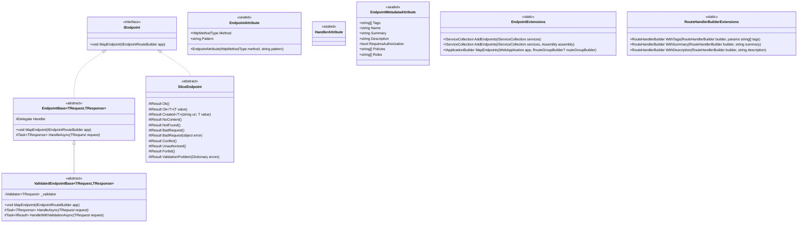
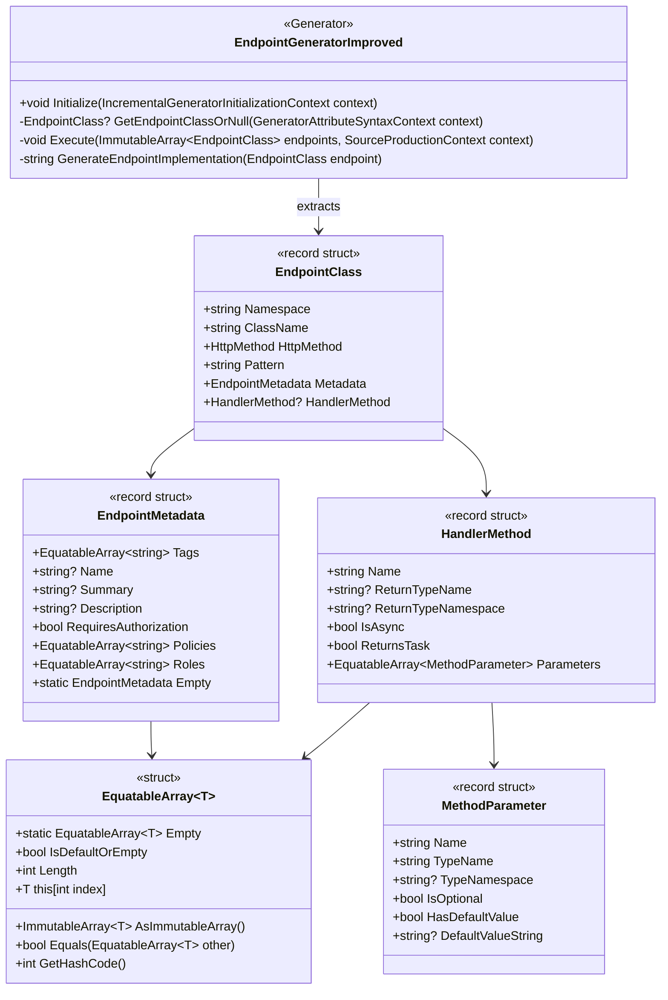
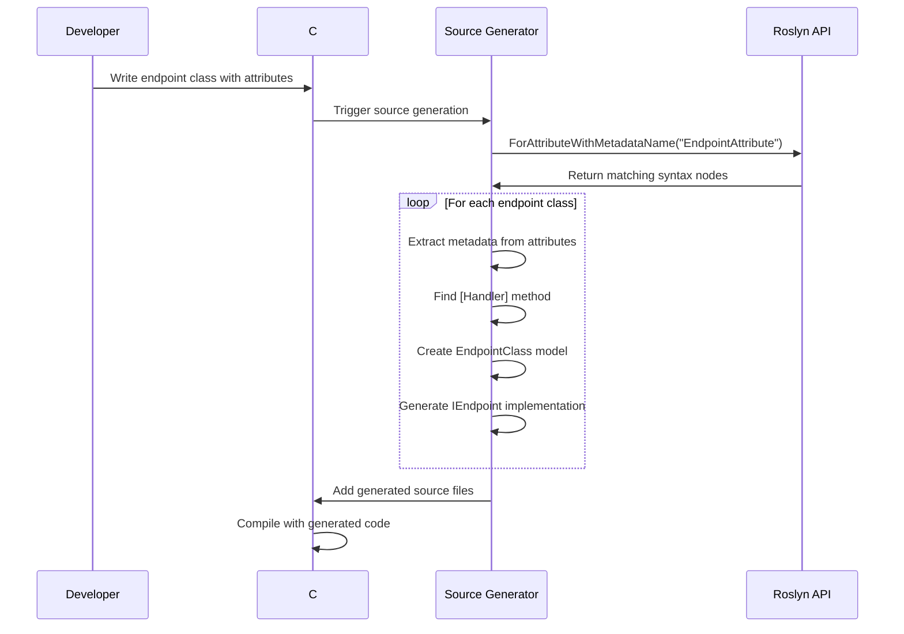

# Tethys Minimal Endpoints Architecture

## Overview

Tethys Minimal Endpoints is a source generator-powered framework that enables vertical slice architecture in ASP.NET Core applications. It uses compile-time code generation to automatically implement endpoint registration, eliminating boilerplate code while maintaining full type safety and performance.

## Architecture Layers



## Core Components

### 1. Base Library (`Tethys.MinimalEndpoints`)

The base library provides the foundational contracts and utilities for the framework.

#### Class Architecture



#### Key Components Explained

1. **IEndpoint Interface**
   - Core contract that all endpoints must implement
   - Single method `MapEndpoint` that registers the endpoint with ASP.NET Core

2. **Attributes**
   - `EndpointAttribute`: Marks a class for source generation and specifies HTTP method and route
   - `HandlerAttribute`: Marks the method that handles the request
   - `EndpointMetadataAttribute`: Provides OpenAPI metadata and authorization configuration

3. **Base Classes**
   - `EndpointBase<TRequest, TResponse>`: For endpoints with typed request/response
   - `ValidatedEndpointBase<TRequest, TResponse>`: Adds FluentValidation support
   - `SliceEndpoint`: Provides helper methods for common HTTP responses

4. **Extension Methods**
   - `AddEndpoints()`: Discovers and registers endpoints in DI container
   - `MapEndpoints()`: Maps all registered endpoints to the routing pipeline

### 2. Source Generator (`Tethys.MinimalEndpoints.ImprovedSourceGenerators`)

The source generator analyzes code at compile-time and generates the IEndpoint implementations.

#### Generator Architecture



#### Source Generation Pipeline



## How It Works

### 1. Developer Experience

The developer writes a simple endpoint class:

```csharp
[Endpoint(HttpMethodType.Get, "/api/products/{id}")]
[EndpointMetadata(
    Tags = new[] { "Products" },
    Summary = "Get product by ID",
    RequiresAuthorization = true,
    Policies = new[] { "ReadProducts" }
)]
public partial class GetProductEndpoint
{
    private readonly IProductService _productService;
    
    public GetProductEndpoint(IProductService productService)
    {
        _productService = productService;
    }
    
    [Handler]
    public async Task<IResult> GetProduct(int id, CancellationToken ct)
    {
        var product = await _productService.GetByIdAsync(id, ct);
        return product is not null 
            ? Results.Ok(product) 
            : Results.NotFound();
    }
}
```

### 2. Source Generator Process

The source generator:

1. **Discovers Classes**: Uses `ForAttributeWithMetadataName` to efficiently find all classes with `[Endpoint]` attribute
2. **Validates**: Ensures class is `partial` and not `abstract`
3. **Extracts Metadata**:
   - HTTP method and route pattern from `[Endpoint]`
   - OpenAPI and authorization info from `[EndpointMetadata]`
   - Handler method marked with `[Handler]`
4. **Generates Implementation**:

```csharp
// Generated by source generator
public partial class GetProductEndpoint : IEndpoint
{
    public void MapEndpoint(IEndpointRouteBuilder app)
    {
        app.MapGet("/api/products/{id}", GetProduct)
           .WithTags("Products")
           .WithSummary("Get product by ID")
           .RequireAuthorization("ReadProducts")
           .WithOpenApi();
    }
}
```

### 3. Runtime Registration

In `Program.cs`:

```csharp
var builder = WebApplication.CreateBuilder(args);

// Add endpoints to DI container
builder.Services.AddEndpoints();

var app = builder.Build();

// Map all endpoints with one line
app.MapEndpoints();

app.Run();
```

The `MapEndpoints()` extension method:
1. Retrieves all `IEndpoint` implementations from DI
2. Calls `MapEndpoint()` on each instance
3. Each endpoint registers itself with the appropriate HTTP verb and route

## Advanced Usage Patterns

### 1. Using Base Classes

For endpoints with request/response models:

```csharp
[Endpoint(HttpMethodType.Post, "/api/products")]
public partial class CreateProductEndpoint : EndpointBase<CreateProductRequest, ProductResponse>
{
    private readonly IProductService _productService;
    
    public CreateProductEndpoint(IProductService productService)
    {
        _productService = productService;
    }
    
    [Handler]
    protected override async Task<ProductResponse> HandleAsync(CreateProductRequest request)
    {
        var product = await _productService.CreateAsync(request);
        return new ProductResponse(product);
    }
}
```

### 2. With Validation

Using FluentValidation:

```csharp
[Endpoint(HttpMethodType.Put, "/api/products/{id}")]
public partial class UpdateProductEndpoint : ValidatedEndpointBase<UpdateProductRequest, IResult>
{
    private readonly IProductService _productService;
    
    public UpdateProductEndpoint(
        IProductService productService,
        IValidator<UpdateProductRequest> validator) : base(validator)
    {
        _productService = productService;
    }
    
    [Handler]
    protected override async Task<IResult> HandleAsync(UpdateProductRequest request)
    {
        await _productService.UpdateAsync(request.Id, request);
        return Results.NoContent();
    }
}
```

### 3. Using SliceEndpoint

For simplified result handling:

```csharp
[Endpoint(HttpMethodType.Delete, "/api/products/{id}")]
public partial class DeleteProductEndpoint : SliceEndpoint
{
    private readonly IProductService _productService;
    
    public DeleteProductEndpoint(IProductService productService)
    {
        _productService = productService;
    }
    
    [Handler]
    public async Task<IResult> Delete(int id)
    {
        var deleted = await _productService.DeleteAsync(id);
        return deleted ? NoContent() : NotFound();
    }
}
```

## Performance Characteristics

### Compile-Time Benefits

1. **Zero Runtime Reflection**: All endpoint discovery happens at compile-time
2. **Optimal Code Generation**: Generated code is as efficient as hand-written code
3. **Incremental Generation**: Only regenerates when endpoint classes change
4. **Type Safety**: Compile-time errors for invalid configurations

### Runtime Benefits

1. **Fast Startup**: No assembly scanning or reflection at startup
2. **Minimal Memory**: No metadata caching or reflection data
3. **Direct Method Calls**: Generated code calls methods directly
4. **AOT Compatible**: Works with Native AOT compilation

## Integration Points

### Dependency Injection

Endpoints are registered as transient services:

```csharp
services.AddEndpoints(); // Registers all IEndpoint implementations
```

Custom lifetime can be configured:

```csharp
services.AddEndpoints();
services.AddScoped<MyEndpoint>(); // Override specific endpoint lifetime
```

### Route Groups

Endpoints can be mapped to route groups:

```csharp
var apiGroup = app.MapGroup("/api")
    .RequireAuthorization()
    .WithOpenApi();

app.MapEndpoints(apiGroup);
```

### Middleware Integration

Works seamlessly with ASP.NET Core middleware:

```csharp
app.UseAuthentication();
app.UseAuthorization();
app.UseRateLimiter();

app.MapEndpoints(); // Endpoints respect middleware pipeline
```

## Error Handling

### Compile-Time Errors

The generator produces clear error messages:

1. **Missing partial keyword**: "Endpoint class must be declared as partial"
2. **No handler method**: "Endpoint class must have exactly one method marked with [Handler]"
3. **Abstract class**: "Endpoint class cannot be abstract"

### Runtime Errors

- Missing dependencies result in standard DI errors
- Route conflicts detected by ASP.NET Core
- Validation errors handled by validation pipeline

## Best Practices

### 1. Organization

```
Features/
├── Products/
│   ├── GetProduct/
│   │   ├── GetProductEndpoint.cs
│   │   ├── GetProductRequest.cs
│   │   └── GetProductResponse.cs
│   ├── CreateProduct/
│   │   ├── CreateProductEndpoint.cs
│   │   ├── CreateProductRequest.cs
│   │   ├── CreateProductValidator.cs
│   │   └── ProductResponse.cs
│   └── Shared/
│       └── ProductService.cs
```

### 2. Naming Conventions

- Endpoint classes: `{Action}{Resource}Endpoint`
- Request models: `{Action}{Resource}Request`
- Response models: `{Resource}Response` or specific if needed
- Handlers: Simple verb names like `Handle`, `Get`, `Create`

### 3. Attribute Usage

```csharp
[Endpoint(HttpMethodType.Get, "/api/products")]
[EndpointMetadata(
    Tags = new[] { "Products" },  // For OpenAPI grouping
    Summary = "List all products", // OpenAPI summary
    Description = "Returns a paginated list of products", // OpenAPI description
    RequiresAuthorization = true,  // Adds .RequireAuthorization()
    Policies = new[] { "ReadProducts" }, // Specific policies
    Roles = new[] { "Admin", "User" }   // Specific roles
)]
```

### 4. Testing

Endpoints are easily testable:

```csharp
[Test]
public async Task GetProduct_ReturnsProduct_WhenExists()
{
    // Arrange
    var productService = Substitute.For<IProductService>();
    productService.GetByIdAsync(1).Returns(new Product { Id = 1, Name = "Test" });
    
    var endpoint = new GetProductEndpoint(productService);
    
    // Act
    var result = await endpoint.GetProduct(1, CancellationToken.None);
    
    // Assert
    var okResult = result.Should().BeOfType<Ok<Product>>().Subject;
    okResult.Value.Name.Should().Be("Test");
}
```

## Future Enhancements

### Planned Features

1. **Parameter Binding Attributes**: Custom binding from headers, query, etc.
2. **Response Type Attributes**: For OpenAPI response documentation
3. **Versioning Support**: API versioning attributes
4. **Rate Limiting**: Declarative rate limit configuration
5. **Caching**: Output caching attributes

### Extension Points

The architecture supports extensions through:

1. **Custom Attributes**: Add new metadata attributes
2. **Base Classes**: Create specialized endpoint base classes
3. **Code Generators**: Additional generators for cross-cutting concerns
4. **Middleware**: Endpoint-specific middleware injection

## Comparison with Alternatives

| Feature | Tethys | FastEndpoints | Carter | Controllers |
|---------|---------|---------------|---------|-------------|
| Registration | Compile-time | Runtime | Runtime | Runtime |
| Performance | Optimal | Good | Good | Good |
| Boilerplate | Minimal | Low | Low | High |
| Flexibility | High | High | Medium | Medium |
| Learning Curve | Low | Medium | Low | Low |
| AOT Support | Yes | Limited | Limited | Yes |

## Conclusion

Tethys Minimal Endpoints provides a powerful yet simple approach to building APIs with vertical slice architecture. By leveraging source generators, it eliminates boilerplate while maintaining full type safety and optimal performance. The framework is designed to be extensible, testable, and aligned with modern ASP.NET Core practices.