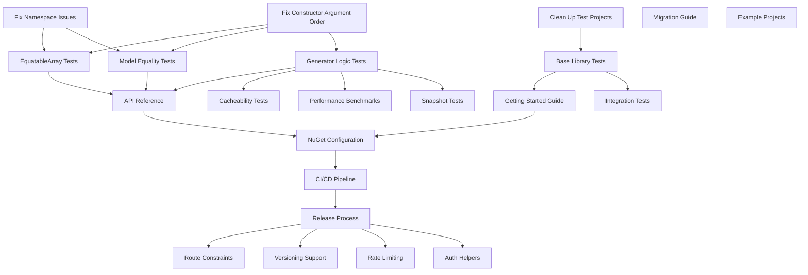

# Stratify Development Plan

## Overview

This document provides a comprehensive, ordered development plan for completing the Stratify Minimal Endpoints framework. Each task includes dependencies, estimated time, and success criteria.

## Task Dependency Graph

## Phase 0: Critical Fixes (MUST DO FIRST)

These bugs prevent the framework from working correctly and must be fixed before any other work.

### TASK-000: Remove FluentAssertions Due to Licensing

- **Priority**: P0 (Critical - Legal)
- **Estimated**: 1-2 hours
- **Dependencies**: None
- **Blocks**: All testing tasks

**Description**: FluentAssertions has licensing restrictions. Remove from all test projects and replace with TUnit assertions.

**Success Criteria**:

- [ ] Remove FluentAssertions NuGet package from all projects
- [ ] Replace all FluentAssertions usages with TUnit assertions
- [ ] All existing tests still pass
- [ ] No build warnings about missing packages

**Files to Modify**:

- `test/Stratify.ImprovedSourceGenerators.SnapshotTests/Stratify.ImprovedSourceGenerators.SnapshotTests.csproj`
- `test/Stratify.ImprovedSourceGenerators.IntegrationTests/Stratify.ImprovedSourceGenerators.IntegrationTests.csproj`
- Any test files using FluentAssertions syntax

### TASK-001: Fix Constructor Argument Order

- **Priority**: P0 (Critical)
- **Estimated**: 2-4 hours
- **Dependencies**: None
- **Blocks**: All testing tasks

**Description**: The `EndpointAttribute` constructor takes `(HttpMethodType method, string pattern)` but the generator extracts them in the wrong order.

**Success Criteria**:

- [ ] Generator correctly extracts method at index 0
- [ ] Generator correctly extracts pattern at index 1
- [ ] All existing tests pass with fix
- [ ] Generated code uses correct HTTP method

**Files to Modify**:

- `src/Stratify.MinimalEndpoints.ImprovedSourceGenerators/EndpointGeneratorImproved.cs`

### TASK-002: Fix Namespace Inconsistencies

- **Priority**: P0 (Critical)
- **Estimated**: 1-2 hours
- **Dependencies**: None
- **Blocks**: Model and equality tests

**Description**: Test helpers create attributes in wrong namespace. Generator expects `Stratify.MinimalEndpoints.Attributes`.

**Success Criteria**:

- [ ] All test helpers use correct namespace
- [ ] Generator finds attributes correctly
- [ ] No namespace-related test failures

### TASK-003: Clean Up Duplicate Test Projects

- **Priority**: P0 (Critical)
- **Estimated**: 1-2 hours
- **Dependencies**: None
- **Blocks**: Accurate coverage metrics

**Description**: Remove duplicate snapshot tests from main test project.

**Success Criteria**:

- [ ] No duplicate tests across projects
- [ ] Clear separation of test types
- [ ] Coverage reports are accurate

## Phase 1: Core Testing (Foundation)

These tests form the foundation of our test suite and must be completed before documentation.

### TASK-004: Comprehensive EquatableArray Tests

- **Priority**: P1 (High)
- **Estimated**: 3-4 hours
- **Dependencies**: TASK-001, TASK-002
- **Blocks**: TASK-008 (API Reference)

**Description**: Test all EquatableArray operations including equality, GetHashCode, operators.

**Success Criteria**:

- [ ] 100% coverage of EquatableArray<T>
- [ ] Tests for value and reference types
- [ ] Edge cases tested (null, empty)
- [ ] Performance characteristics documented

### TASK-005: Model Record Equality Tests

- **Priority**: P1 (High)
- **Estimated**: 2-3 hours
- **Dependencies**: TASK-001, TASK-002
- **Blocks**: TASK-008 (API Reference)

**Description**: Test equality for all model records (EndpointClass, EndpointMetadata, etc.).

**Success Criteria**:

- [ ] All models have equality tests
- [ ] GetHashCode distribution verified
- [ ] Null handling tested
- [ ] With/deconstruct patterns tested

### TASK-006: Generator Logic Unit Tests

- **Priority**: P1 (High)
- **Estimated**: 4-6 hours
- **Dependencies**: TASK-001
- **Blocks**: TASK-013 (Cacheability), TASK-016 (Snapshot)

**Description**: Unit test all generator methods and transformations.

**Success Criteria**:

- [ ] 80%+ coverage of generator logic
- [ ] All extraction methods tested
- [ ] Edge cases covered
- [ ] Error scenarios tested

### TASK-007: Base Library Tests

- **Priority**: P1 (High)
- **Estimated**: 3-4 hours
- **Dependencies**: TASK-003
- **Blocks**: TASK-007 (Getting Started)

**Description**: Test IEndpoint, base classes, and extension methods.

**Success Criteria**:

- [ ] All public APIs tested
- [ ] Integration scenarios covered
- [ ] Thread safety verified
- [ ] Performance acceptable

## Phase 2: MVP Documentation

Documentation required for initial release.

### TASK-008: Getting Started Guide

- **Priority**: P1 (High)
- **Estimated**: 1 day
- **Dependencies**: TASK-007
- **Blocks**: TASK-010 (NuGet)

**Description**: Create step-by-step guide for new users.

**Success Criteria**:

- [ ] Installation instructions
- [ ] First endpoint example
- [ ] Common patterns shown
- [ ] Troubleshooting section

### TASK-009: API Reference

- **Priority**: P1 (High)
- **Estimated**: 2 days
- **Dependencies**: TASK-004, TASK-005, TASK-006
- **Blocks**: TASK-010 (NuGet)

**Description**: Document all public APIs with examples.

**Success Criteria**:

- [ ] All public types documented
- [ ] Code examples for each
- [ ] IntelliSense XML comments
- [ ] Generated docs site

### TASK-010: Migration Guide

- **Priority**: P2 (Medium)
- **Estimated**: 1 day
- **Dependencies**: TASK-008
- **Blocks**: None

**Description**: Guide for migrating from controllers to minimal endpoints.

**Success Criteria**:

- [ ] Before/after examples
- [ ] Common pitfalls covered
- [ ] Performance comparisons
- [ ] Decision matrix

### TASK-011: Example Projects

- **Priority**: P2 (Medium)
- **Estimated**: 2 days
- **Dependencies**: TASK-008
- **Blocks**: None

**Description**: Create 2-3 example projects showing different patterns.

**Success Criteria**:

- [ ] Basic CRUD API
- [ ] Complex validation example
- [ ] Auth/versioning example
- [ ] All examples build/run

## Phase 3: Package & Release

Required for NuGet distribution.

### TASK-012: NuGet Package Configuration

- **Priority**: P1 (High)
- **Estimated**: 4 hours
- **Dependencies**: TASK-008, TASK-009
- **Blocks**: TASK-013, TASK-014

**Description**: Configure projects for NuGet packaging.

**Success Criteria**:

- [ ] Package metadata complete
- [ ] Dependencies correct
- [ ] Icon and readme included
- [ ] Local pack/test works

### TASK-013: CI/CD Pipeline

- **Priority**: P1 (High)
- **Estimated**: 1 day
- **Dependencies**: TASK-012
- **Blocks**: TASK-014

**Description**: Set up GitHub Actions for build, test, and publish.

**Success Criteria**:

- [ ] Build on all platforms
- [ ] Tests run and pass
- [ ] Coverage reports generated
- [ ] NuGet publish ready

### TASK-014: Initial Release Process

- **Priority**: P1 (High)
- **Estimated**: 4 hours
- **Dependencies**: TASK-013
- **Blocks**: All advanced features

**Description**: Document and execute initial release.

**Success Criteria**:

- [ ] Version strategy defined
- [ ] Change log created
- [ ] Package published to NuGet
- [ ] Announcement prepared

## Phase 4: Quality & Performance

Advanced testing for production readiness.

### TASK-015: Cacheability Tests

- **Priority**: P2 (Medium)
- **Estimated**: 1 day
- **Dependencies**: TASK-006
- **Blocks**: None

**Description**: Test incremental compilation performance.

**Success Criteria**:

- [ ] Unchanged input = cached output
- [ ] Whitespace changes handled
- [ ] Performance metrics collected
- [ ] Memory usage acceptable

### TASK-016: Performance Benchmarks

- **Priority**: P2 (Medium)
- **Estimated**: 1 day
- **Dependencies**: TASK-006
- **Blocks**: None

**Description**: Benchmark generator and runtime performance.

**Success Criteria**:

- [ ] BenchmarkDotNet setup
- [ ] Compilation time measured
- [ ] Runtime overhead measured
- [ ] Comparison with alternatives

### TASK-017: Expanded Integration Tests

- **Priority**: P2 (Medium)
- **Estimated**: 2 days
- **Dependencies**: TASK-007
- **Blocks**: None

**Description**: Test real-world integration scenarios.

**Success Criteria**:

- [ ] Multi-project solutions
- [ ] Complex routing tested
- [ ] Middleware integration
- [ ] Error scenarios

### TASK-018: Comprehensive Snapshot Tests

- **Priority**: P2 (Medium)
- **Estimated**: 1 day
- **Dependencies**: TASK-006
- **Blocks**: None

**Description**: Snapshot test all generated code variations.

**Success Criteria**:

- [ ] All attribute combos tested
- [ ] Edge cases covered
- [ ] Snapshots reviewed
- [ ] Verify.TUnit configured

## Phase 5: Advanced Features

Post-MVP enhancements.

### TASK-019: Route Constraints Support

- **Priority**: P3 (Low)
- **Estimated**: 2-3 days
- **Dependencies**: TASK-014
- **Blocks**: None

**Description**: Add support for route constraints in patterns.

**Success Criteria**:

- [ ] Constraint syntax supported
- [ ] Common constraints work
- [ ] Custom constraints possible
- [ ] Generated correctly

### TASK-020: Versioning Support

- **Priority**: P3 (Low)
- **Estimated**: 3-4 days
- **Dependencies**: TASK-014
- **Blocks**: None

**Description**: Add API versioning support.

**Success Criteria**:

- [ ] Version attributes
- [ ] URL/header versioning
- [ ] Version discovery
- [ ] Documentation updated

### TASK-021: Rate Limiting Integration

- **Priority**: P3 (Low)
- **Estimated**: 2 days
- **Dependencies**: TASK-014
- **Blocks**: None

**Description**: Add rate limiting helpers.

**Success Criteria**:

- [ ] Rate limit attributes
- [ ] Policy configuration
- [ ] Per-endpoint limits
- [ ] Testing helpers

### TASK-022: Auth/AuthZ Helpers

- **Priority**: P3 (Low)
- **Estimated**: 2-3 days
- **Dependencies**: TASK-014
- **Blocks**: None

**Description**: Simplified authentication/authorization.

**Success Criteria**:

- [ ] Auth attributes
- [ ] Policy helpers
- [ ] Claims extraction
- [ ] Testing utilities

## Execution Order

### Week 1: Critical Fixes & Core Testing

1. TASK-001: Fix constructor (Day 1)
2. TASK-002: Fix namespaces (Day 1)
3. TASK-003: Clean up tests (Day 1)
4. TASK-004: EquatableArray tests (Day 2)
5. TASK-005: Model tests (Day 2)
6. TASK-006: Generator tests (Days 3-4)
7. TASK-007: Base library tests (Day 5)

### Week 2: Documentation & Release

8. TASK-008: Getting started (Day 6)
9. TASK-009: API reference (Days 7-8)
10. TASK-012: NuGet config (Day 9)
11. TASK-013: CI/CD (Day 9)
12. TASK-014: Release (Day 10)

### Week 3+: Quality & Features

13. TASK-010: Migration guide
14. TASK-011: Examples
15. TASK-015: Cacheability
16. TASK-016: Performance
17. TASK-017: Integration
18. TASK-018: Snapshots
19. TASK-019-022: Advanced features

## Success Metrics

### MVP Release (7-10 days)

- All Phase 0 & 1 tasks complete
- Core documentation done
- Package published to NuGet
- No critical bugs

### Production Ready (2-3 weeks)

- 80%+ test coverage
- Performance benchmarked
- Full documentation
- Example projects

### Feature Complete (4-6 weeks)

- All planned features
- Tooling and templates
- Community feedback incorporated
- Competitive with alternatives

## Risk Mitigation

### High Risk Items

1. **Constructor bug** - Blocks everything, fix first
2. **Test coverage** - Required for confidence
3. **Documentation** - Required for adoption

### Mitigation Strategies

1. Fix critical bugs before any feature work
2. Write tests for all new code
3. Document as you go, not at the end
4. Get feedback early and often

## GitHub Issue Creation

Each task above should become a GitHub issue with:

- Clear title: `[TASK-XXX] Brief description`
- Labels: priority, type, phase, size
- Milestone assignment
- Dependencies noted
- Success criteria as checklist

Use `scripts/export-github-issues.py` to generate issues from this plan.
